# The Pwndoc Book

## Installation

pwndoc-ng is a containerized application, so the Docker Engine is required to run it.We successfully installed the pwndoc-ng application on two different environments:

- For testing purpose, templates development and custom code, we install the application on a Windows 11 machine using Docker Desktop
- For production purpose, we deployed an Ubuntu Server Virtual Machine, on Microsoft Azure. Deploying on AWS should be nearly identical.

### Pwndoc-ng on Windows using Docker Desktop

#### Getting Docker Desktop

Guess what? Sometimes you will have to debug the software or ass some new cool features, as I painfully did. To do so, the easiest way is to install Docker Desktop on your powerful laptop. Take a browser and navigate to <https://www.docker.com/products/docker-desktop/> and download the suitable version for whatever Operating System you waste your time on. Docker Compose is bundled with Docker Desktop so don't need to install it.

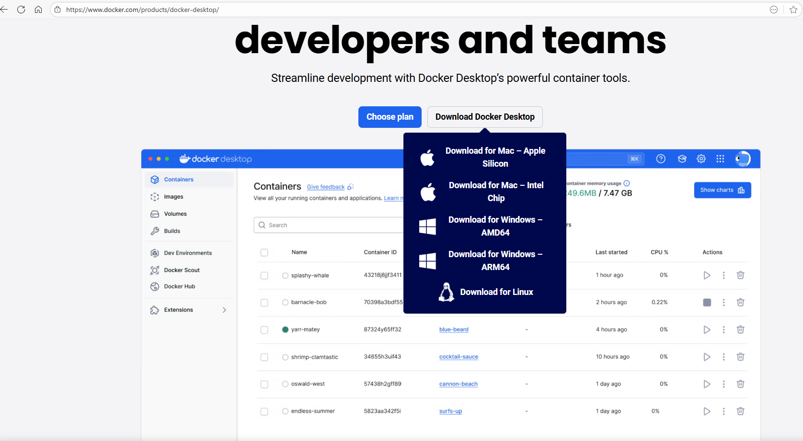

Whoops, on Windows, I forgot to talk about WSL (Windows Subsystem for Linux). Docker Desktop won't run on Windows without it. Fortunately, the good guys and gals at Docker tell you what are the steps to follow. Just go to <https://docs.docker.com/desktop/setup/install/windows-install/> and you're good to go.

#### Getting Git

Yeah fine, no you need a Git client to get Pwndoc files. As I used Windows, I just installed the Git Bash Software from <https://git-scm.com/install/windows>.

Once the installation is completed, check that `git` is present by typing in a command line interface

```Powershell
git --version
```

Something like that should pop-up:

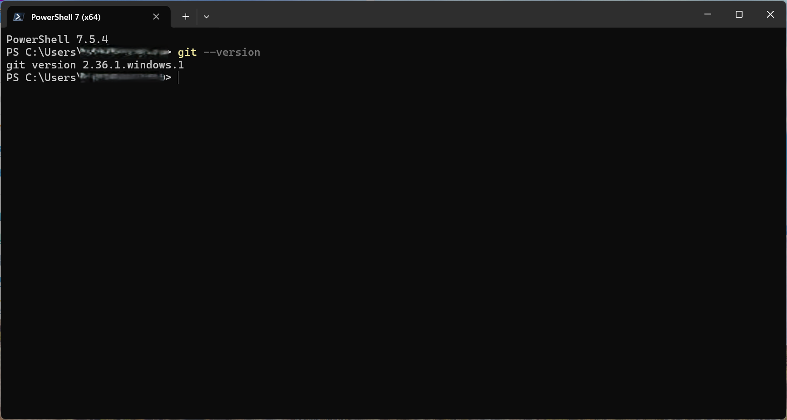

Otherwise, stop working in IT and apply for an AI enhanced cashier job.

#### Getting MongoDB Compass and Mongosh

To manage the Mongo DB database, we installed locally the Mongo DB Compass tool from <https://www.mongodb.com/products/tools/compass> as well as the Mongo Shell mongosh from <https://www.mongodb.com/try/download/shell>. Remember, buttons are for idiots. This quote is from the OpenBSD project founder, so...

Note that you can manage the pwndoc-ng Mongo Database without installing any tool, but you won't have a nice GUI. See relevant **FIXME**

#### Downloading and Running pwndoc-ng

Because of my long career in IT, I created the folder `bin` in my home directory, even if I'm on a Windows. Use any methods that is suitable for you. You can of course use any folder hierarchy.

- Once in your folder, using a command line, retrieve the Pwndoc files by typing, or copy-pasting, the following command line:

```Powershell
 git clone https://github.com/pwndoc-ng/pwndoc-ng.git
```

- Change current directory to pwndoc-ng

```Powershell
cd pwndoc-ng
```

- Fire up pwndoc-ng

```Powershell
docker-compose up -d --build 
```

- Open a browser and go to <https://localhost:8443>.

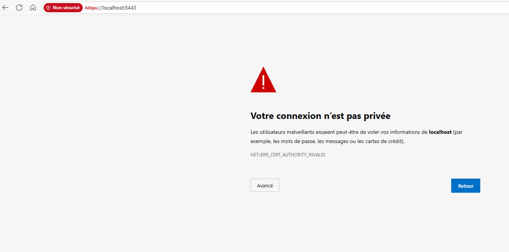

Accept the security risk. If the pwndoc-ng database is empty, you will be prompted to create an admin user. Sorry, no screenshot available for a first time install, I need to keep my local database, but here is a screenshot from a running local pwndoc-ng instance:

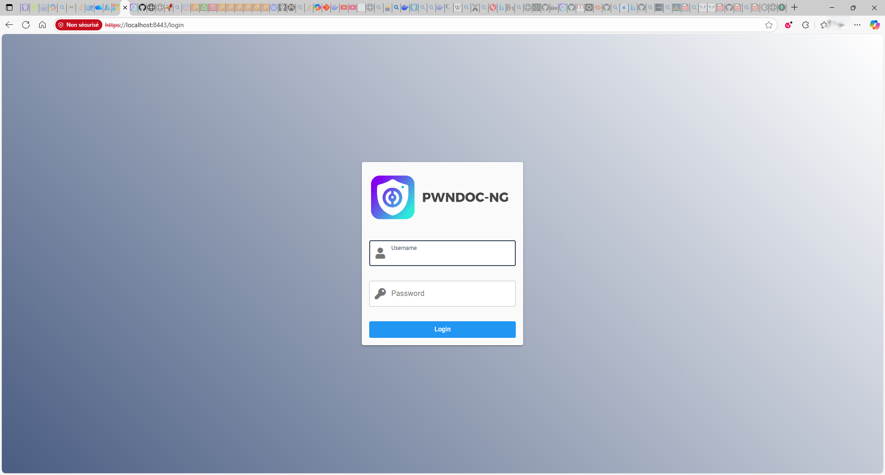

Done for the Windows installation using Docker Desktop. It was so good !

### File System Folder Layout for pwndoc-ng

I know,I know ,Kubernetes is everything now for application deployment, but guess what? It was faster and easier to install pwndoc-ng on a virtual machine because the learning curve was non-existent.

The required files for running pwndoc-ng should be put in the folder `/app`. This directory does not exist by default, so you will have to use your fingers (copy/paste should work too) to enter the following command:

```bash
sudo mkdir /app
```

But if you want to use another layout such as `/EA000000FFFAC3/`, be my guest.

### Docker Engine Installation

Nothing fancy here, just follow the step on the official Docker website (<https://docs.docker.com/engine/install/ubuntu/>). Be sure to follow the post-installations step (<https://docs.docker.com/engine/install/linux-postinstall/>) if you do not want to type `sudo docker-compose`or `sudo docker something` each time.

No need to tell you to perform the mandatory stuff before:

```bash
sudo apt-get update && sudo apt-get upgrade
```

If you are in the mood of burning bandwidth a

```bash
sudo apt-get dist-upgrade
```

will make your day. You can now install the Docker engine using the urls previously mentioned.

Should work for any Ubuntu underlying platform, be it a local Virtual Machine or a cloud-based one.

### Cloning the pwndoc-ng repository

Imagine you are a pianist, in front of your keyboard. You are logged in the Ubuntu virtual machine. You start by typing

```bash
sudo cd /app
```

Take a deep breath. Now type the following

```bash
sudo git clone https://github.com/pwndoc-ng/pwndoc-ng.git
```

You hear a voice in the dark saying that running git as root is not a good idea, but who cares?
Of course, if an error message  such as

```bash
git: command not found
```

pop up, well, I don't know, maybe try to install git:

```bash
sudo apt-get update && sudo apt-get install git
```

Typing the following command will build an d run the containers:

```bash
cd /app/pwndoc-ng && sudo docker-compose up -d --build
```

### Ubuntu Virtual Machine

Repeat after me : redundancy in a book is boring and unappealing, that's why I document the installation of pwndoc-ng on an Ubuntu Virtual Machine using Virtual Box on a Windows 11 Professional. The one who shout "Hyper-V" must eat a rotten stone.

Joke aside, I need some screenshots of the whole process of installing pwndoc-ng, and fire-up an instance in a Virtual Machine is the way I found to provide you with pictures.

After having downloaded and installed Virtual Box and create an Ubuntu Virtual Machine, we followed the step aforementioned :

- create a folder layout
- install the docker engine and docker-compose
- change to the `/app` directory and clone the pwndoc-ng repository
- build and run the containers

We perform a basic installation of pwndoc-ng, meaning we won't describe how to patch some source code to add custom docx-templater expression filters. Sounds meaningless ?Continue reading if you want your brain to dismiss the fog.

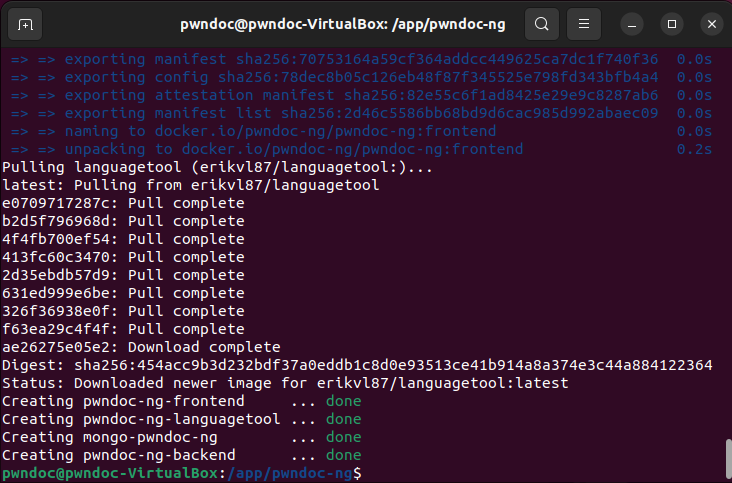

You can then access the application at <https://localhost:8443> :

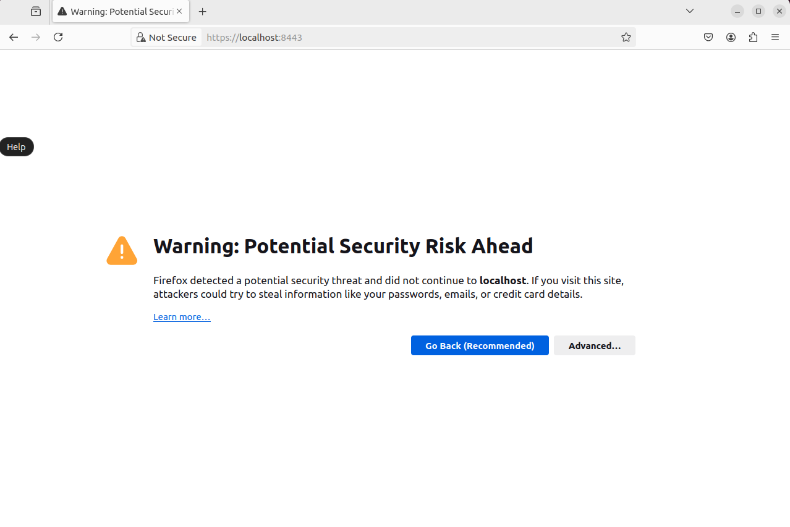

Accept the security risk; you are now rewarded with the first time use GUI. Notice that the application won't work with Firefox on Ubuntu, so we switched to the Chrome browser.

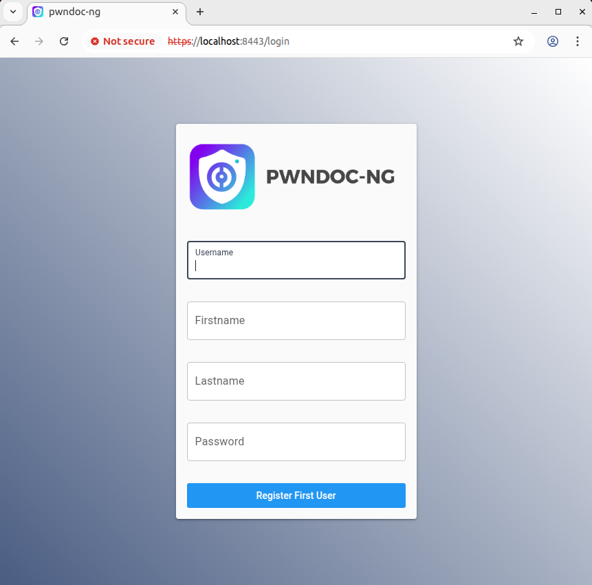

### Cloud-based Ubuntu Virtual Machine

Having a pwndoc-ng instance running on your local pentesting machine can be cool, but you certainly want to be able to collaborate. What other great way than popping a Virtual Machine to do so?

You must restrict the access to the running instance for obvious security reasons. You don't want this guy from hostile part of the world accessing precious data. Nothing dumber than a security related product without security enforced.

#### Azure-based Virtual Machine

Refer to the official Microsoft documentation to create an Ubuntu VM. We use a 2 vCPU with 8 Go RAM
and it worked just fine.

#### AWS-based Virtual Machine

Refer to the official AWS documentation to create an Ubuntu VM. We use a 2 vCPU with 8 Go RAM
and it worked just fine. (yeah, copy-paste)

## pwndoc-ng configuration

### Caveat

If you ant to use our custom charts filter described later, do not forget to patch the file `pwndoc-ng/backend/src/lib/report-generator.js` by appending the file you can find at <https://gist.githubusercontent.com/p4r4bellum/c333102c9356d41a6eb97038eb9bad32/raw/ec0375883975ec096a358e7de98c5cc61f6dd7eb/fruisek-pwndoc-patch.js>

```bash
curl -L https://gist.githubusercontent.com/p4r4bellum/c333102c9356d41a6eb97038eb9bad32/raw/ec0375883975ec096a358e7de98c5cc61f6dd7eb/fruisek-pwndoc-patch.js -o /tmp/patch.js
sudo su - 
cat /tmp/patch.js >> /app/pwndoc-ng/backend/src/lib/report-generator.js
exit
```

You have to apply the patch before building the containers.

### First User Registration

With a brand new installation, you have to create the first user, which will be admin. Pick-up any username you want. Choose a strong password, put your first name and last name and the click "Register First User". Notice that the GUI won't ask you to confirm your password.

We created the "Al BEBACK" user.

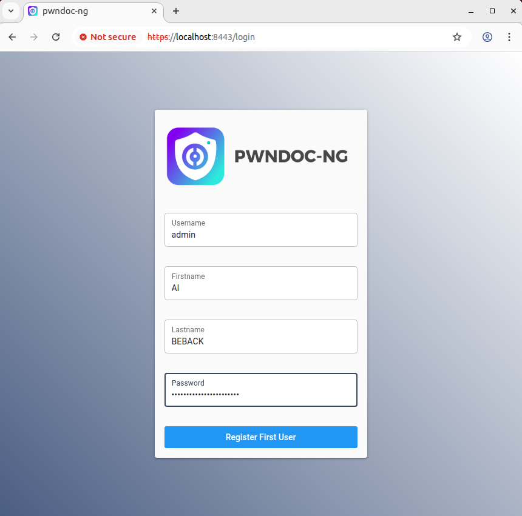

### Creating and Updating a Language

Now, you must create a language.

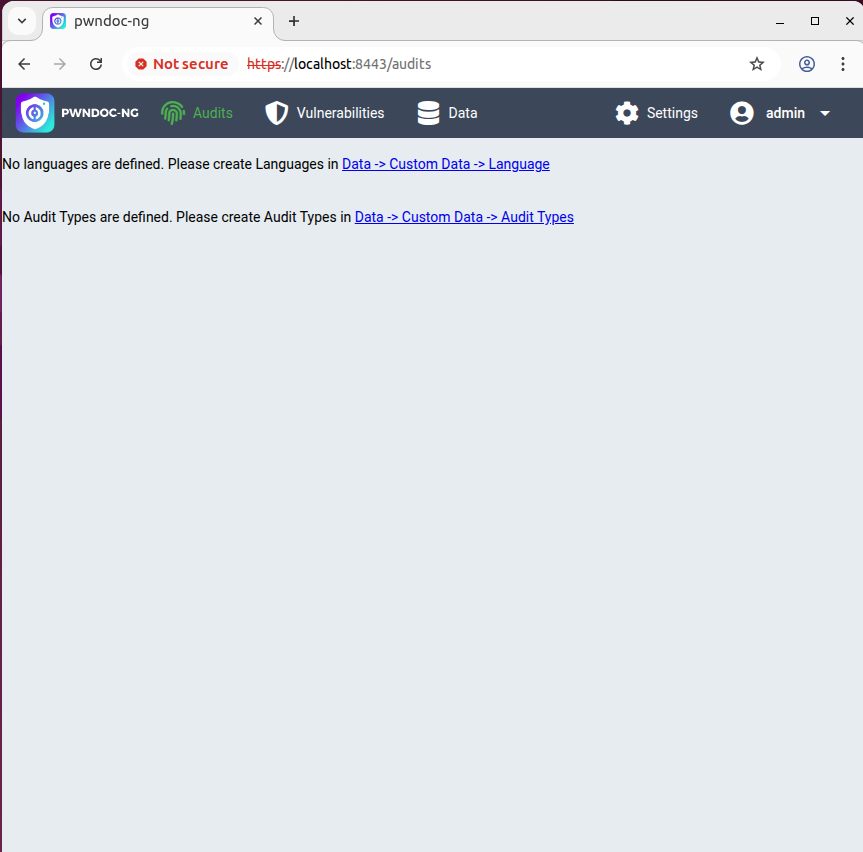

Go to <https://localhost:8443/data/custom/>, you will be redirected to the language creation page:

As we are a little bit pedantic, we created an "american english" language with the corresponding ISO-compliant locale:

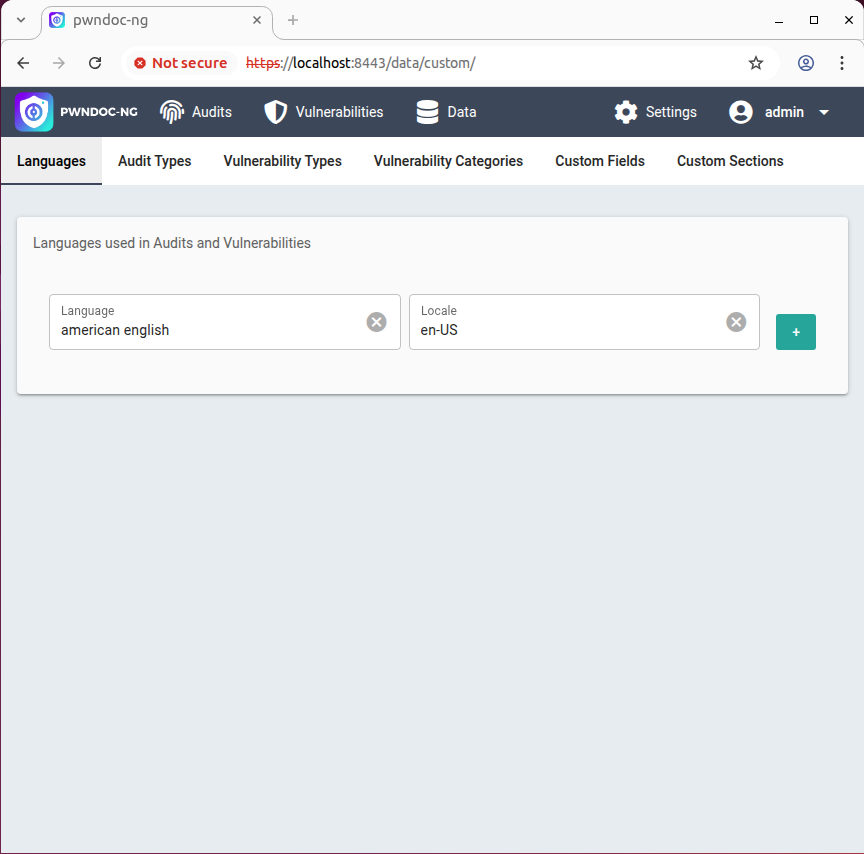

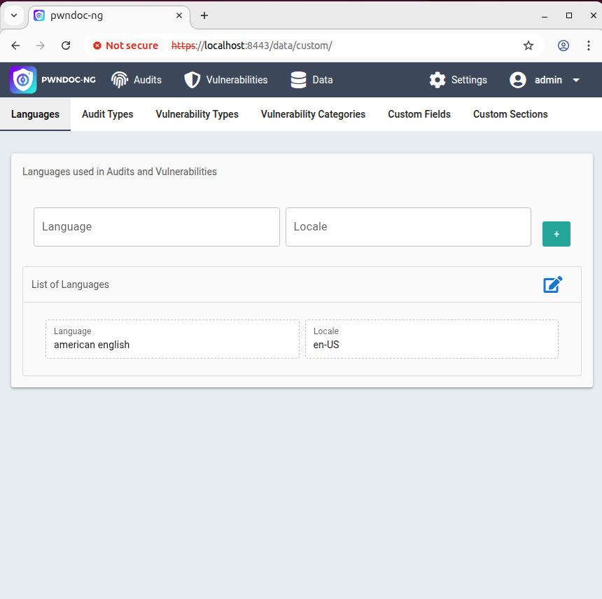

But it's a little be weird, so we update this language to rename it as "english" with the locale "en":

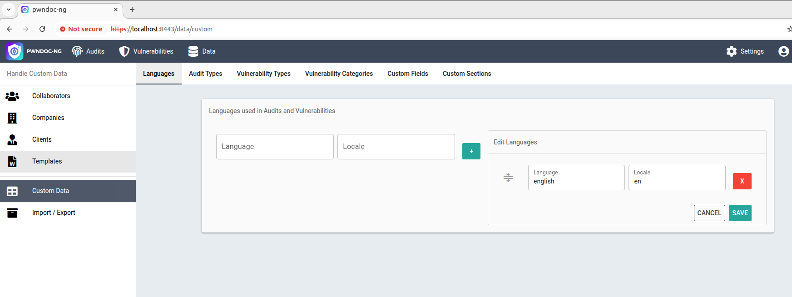

Click on the "save" button and your language is updated.

### Creating a Template

Before creating an "Audit Type", you must create a template. Creating a template requires a name and `docx` file. You can find a default docx template in the `backend/report-templates` directory:

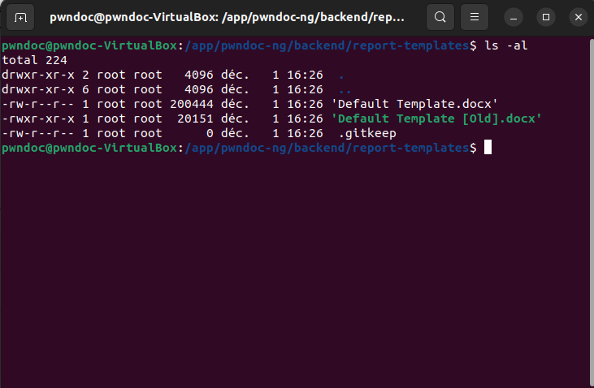

Navigate to <https://localhost:8443/data/templates> and click on `Create Template`

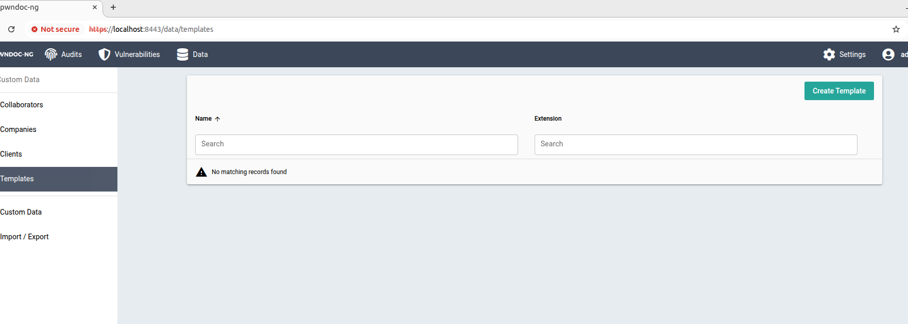

You must provide a Template name as well as a `docx`file:

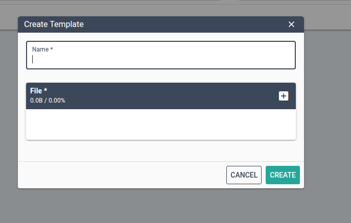

It's better to have a naming convention. What we use is something like \[your company name\] \[Audit Type\] Template \[language locale\]

```text
For example:
- my company is SecureCorp
- the audit type is "Web Application Pentest"
- the language of the audit will be in english, so the locale will be "en"

Adapt the casing to your taste, and you will have the name of your first pwndoc-ng template : 
SecureCorp Web Application Pentest Template EN
```

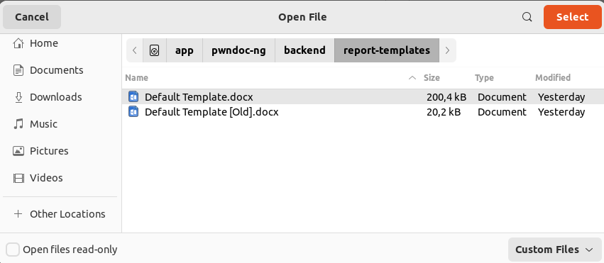

Once the fields are completed, click the `create` button.

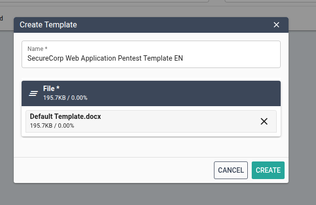

Congratulations !You have created your first Template within pwndoc-ng !

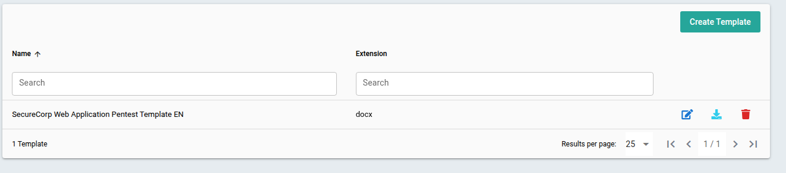

### Creating an Audit Type

We now create an "Audit Types". We usually create the following type of audit:

- Web Application Pentest
- Web Application Validation Audit
- Source Code Audit
- Active Directory Pentest
- Wi-Fi Pentest

For now, we will only create a "Web Application Pentest" type of Audit, using the template we have created in the previous section. The `Web Application Validation Audit` is a special case we discuss later. To create an Audit Type, navigate to `Custom Data` and click on the `Audit Types`tab:

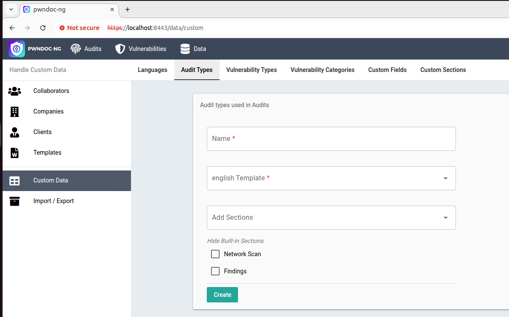

Then, process as follow:

- In the field name, put "Web Application Pentest" 
- In the Drop Down List choose a template for each language. A Drop Down List will be created for each language. For now, whe have only one language and one template.
- Leave the "Add Sections". We will talk about sections later.
- Click the `Create`button.

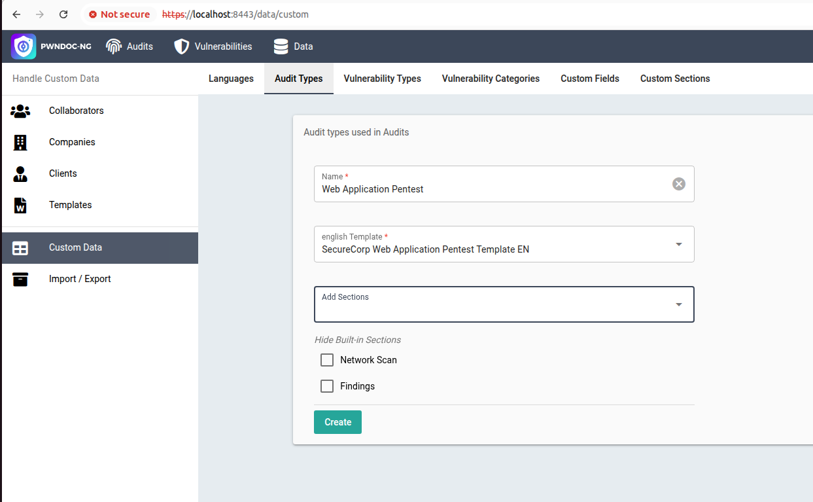

Enjoy your first  "Audit Types" !

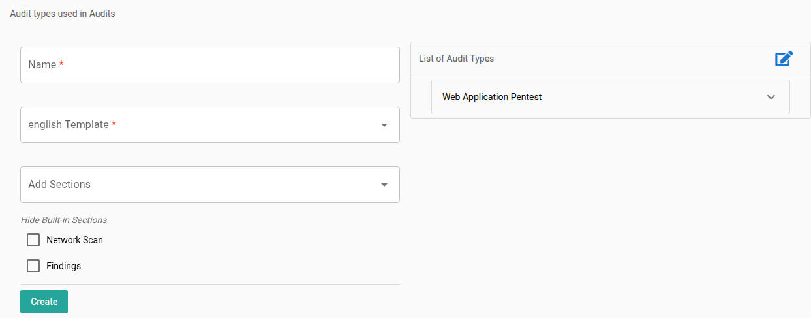

At this point you can create a new audit !

### Creating an Audit

Click on the `New Audit`, you will be granted with a sort-of pop-up:


Give a name to your audit, following a clear naming convention. The one I used was YYYYMMDD-[Client Name]-[Application Name]. Skilled reader will say "Hey, we do not have any client yet!". Fair point. But to create an audit, no client is required. So we will create an audit named `20230229-SecureCorp-FakeApp`.

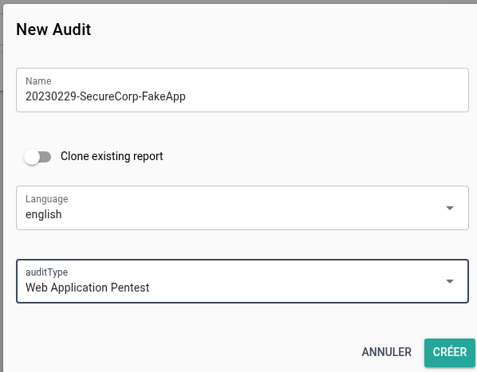

Choose the language (english, no choice) and the Audit Type (once again, no choice), and click on the `Créer` button - seems to have some issues with the internationalization of the app.

Yes ! A new Audit was created !

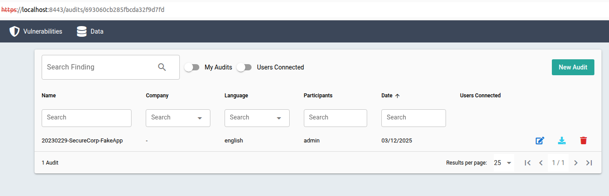

Try to download it, and open it. You should see a bunch of "undefined" text, because these properties are not set in our audit.

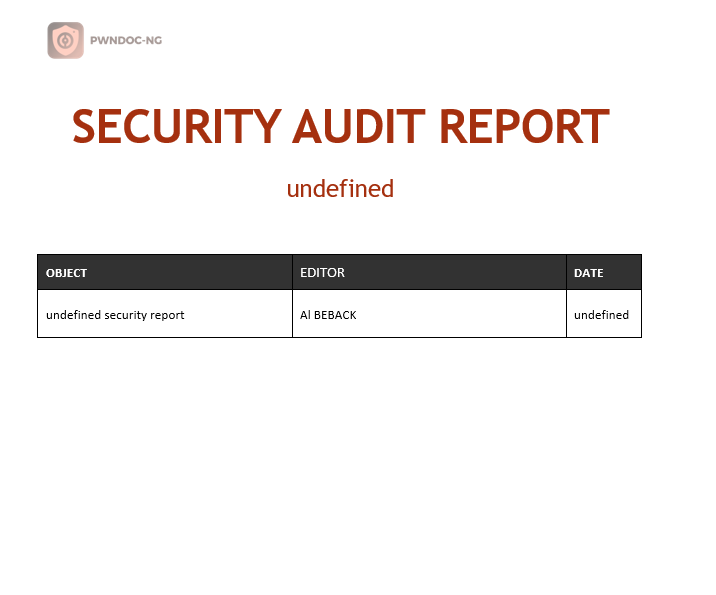

Let's fix that by editing our audit. Double-click on its name or click on th  `edit` icon.

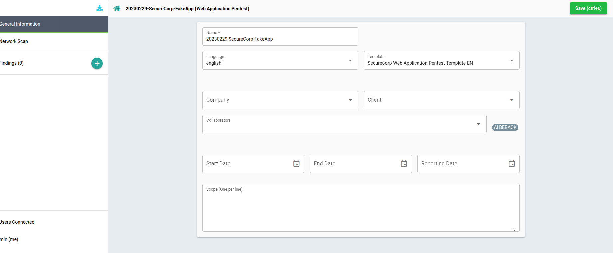

Notice the empty fields. They cause the text "undefined" to rendered in the generated document.
We cannot fix all the issues here, because we have no clients, we have no company, nothing. Before creating these business objects, let's describe the view, corresponding to the general properties of an audit:

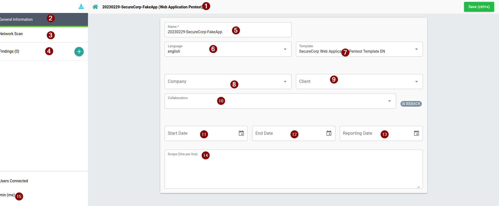

1. The name of the audit, with its type between parentheses
2. The section "General Information". The current section is greyed.
3. The network scan section. Here, you can upload an NMAP style XML file.
4. The findings sections. This section contain all the vulnerabilities discovered during an audit
5. The name of the audit, following a very good naming convention
6. The language of the audit. You can change it, but think to update the Template property too
7. The template used to generate the docx file. You can update it.
8. The company who ask to be P0wned
9. The individual within the company who asked to be P0wned. It is usually the audit sponsor
10. The list of collaborators involved in the current audit. The creator of the audit is always a collaborator. Other collaborator must be created in the application.
11. The start date of the audit. Should be known
12. The end date of the audit. Should be known
13. The reporting date, when you send the report to your client. Even if you don't know the date precisely, it's better to put one. No check is performed to see if the report date is before the start of the audit.
14. The scopes audited. For a Web Application Pentest, is mainly a list of url or domain à la bug bounty.
15. The list of  users connected to the application

### Creating a Company

Navigate to <https://[ip or domain]:8443/data/comapnies> and click on the `Add Company` button:

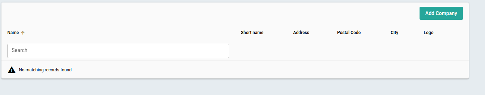

Only `Name` is mandatory, but you can give the company a `Short name` (useful if the real company name is way tooooooo long), an address, a Postal code , a City and a Logo. The Company logo can be then used in the rendered document. Be aware that the rendering of the document can be be severely altered depending on the size of the logo, so it's better to have the same image size for all your company logos.

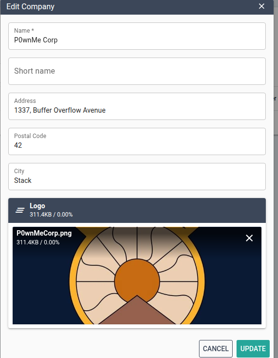

The title of the pop-up is `Edit Company` because I click to quickly on the `Create` button, but you got the point. So, I will click `Update` instead of `Create`, not really a big deal.

Be proud for having created the `P0wnMe Corp` !

### Creating a Client

Navigate to <https://localhost:8443/data/clients> and click the `Add Client` button.

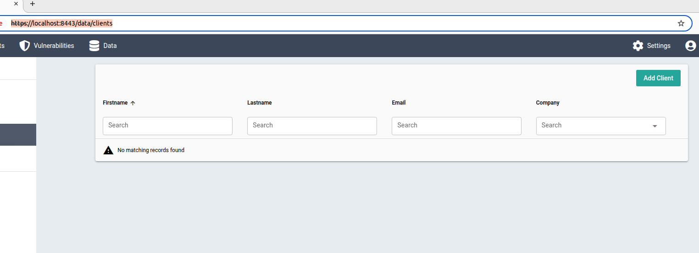

Fill the required fields.

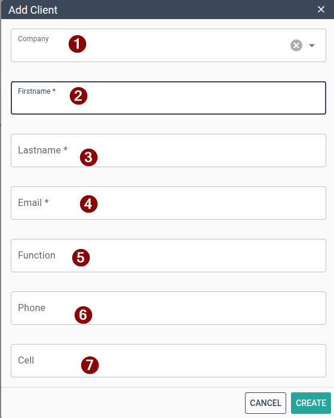

1. The company. You have only one so easy choice
2. First Name
3. Last name
4. Email
5. Function
6. Phone number
7. Cell phone number

Our brand new client will be created with the following data:

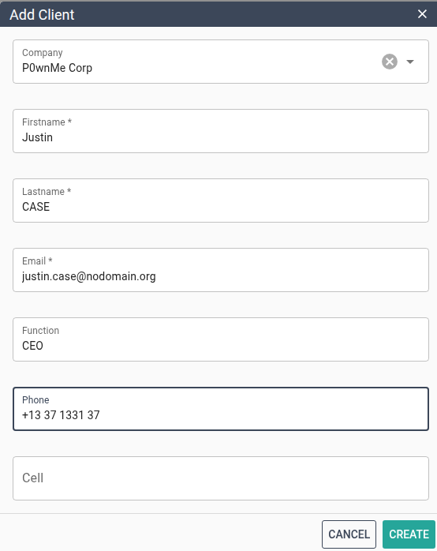

Congratulations for having successfully created a new client !

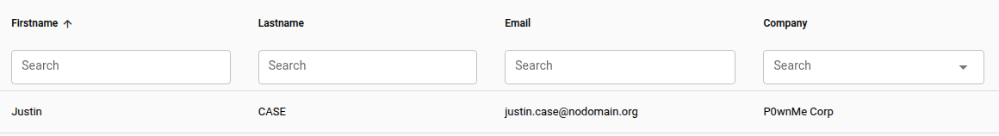

### Fixing the Audit (1)

Go back to the audit created earlier, and update the fields accordingly :

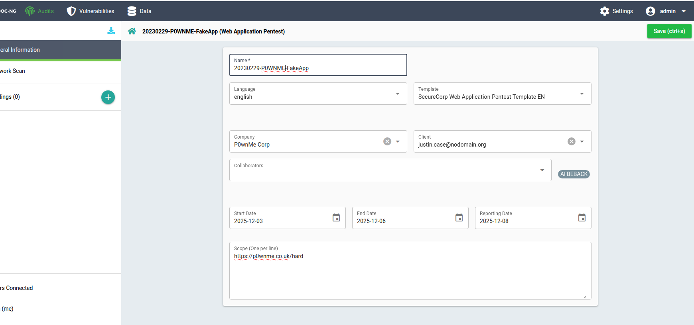

Notice we update the Title of the audit to match our naming convention YYYYMMDD-\[Company Name\]-\[Application Name\]. Click the `save` button and download the report. The "undefined" pandemic should be fixed.


Nice !But what about vulnerabilities ?

### Creating Vulnerabilities

#### Manually

Painful. I'll describe it later

#### Importing Vulnerabilities

Some good guys share their vulnerabilities to be imported in pwndoc-ng. You can find a list of vulnerabilities in the french and english language at <https://gist.githubusercontent.com/p4r4bellum/7dc17ccc70558176155bfa0264d44a4a/raw/011e1f9cfbcfd55a79faffeec81f97c0baf7c2c7/20251120-vulnerabilities.yml>.

Download the files using whatever method you prefer. As I am in a Virtual Machine with a GUI, I'll be lazy and download the list using the Chrome Browser.

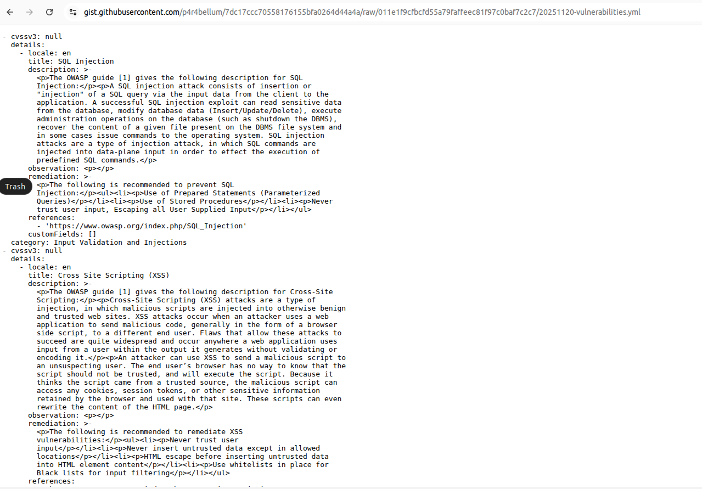

`Ctrl+s`powa

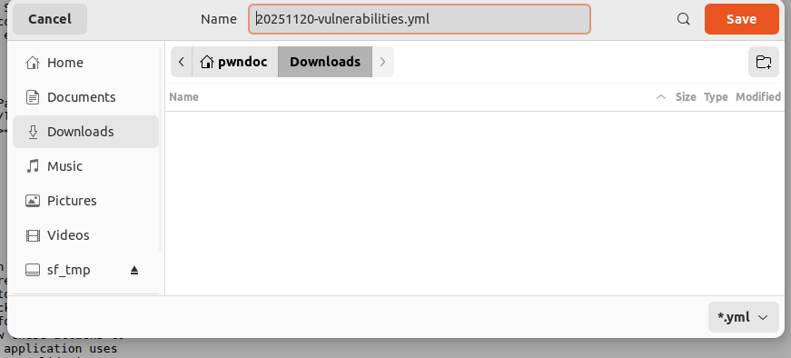

Navigate to <https://localhost:8443/data/dump>, click the `import` button, and select the YAML file you have just downloaded:

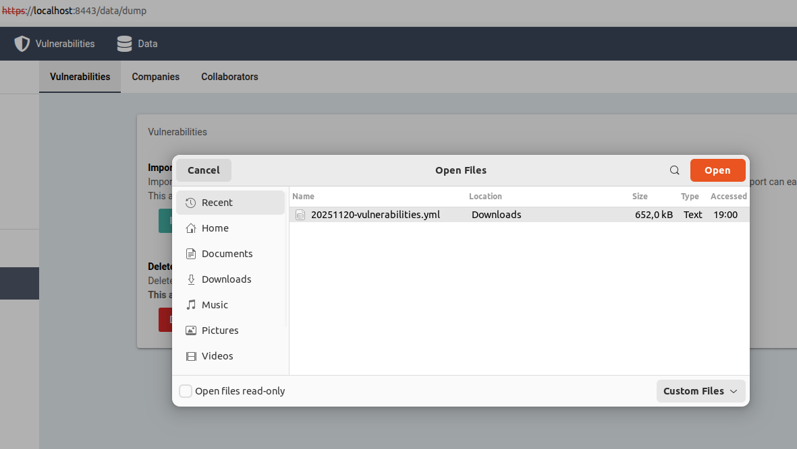

The import should be fine. Go to <https://localhost:8443/vulnerabilities> to see all the vulnerabilities imported:

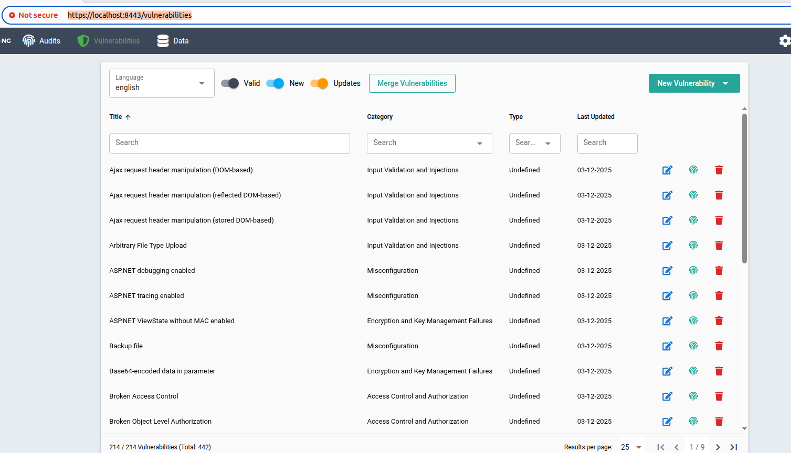

The import also created several vulnerability categories :

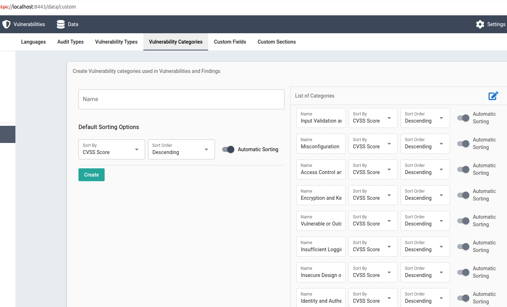

Something strange happens, however. We cannot see the french version of the vulnerabilities, because the french language does not exist within pwndoc-ng.

So create a language `français` with the locale `fr`. The locale must match the locale found in the YAML file:

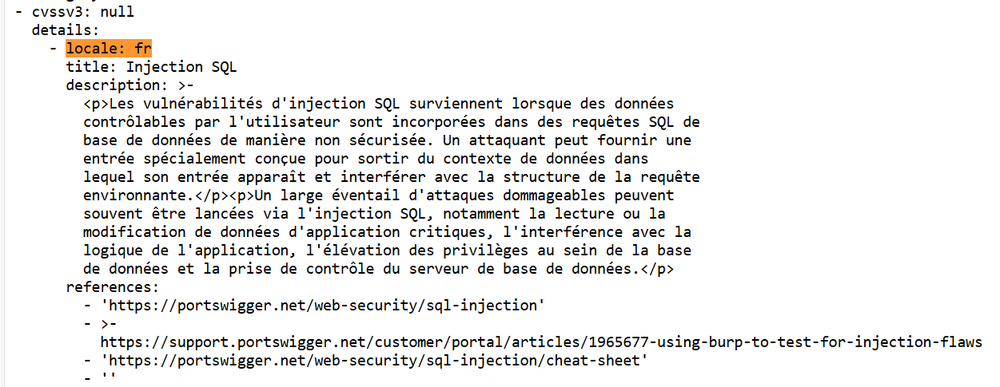

You know how to create a language, I won't repeat.

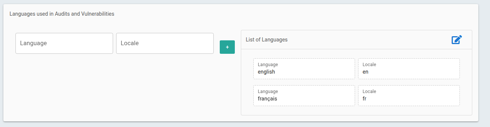

No go back to the list of vulnerabilities, you should see the french version of the vulnerabilities.

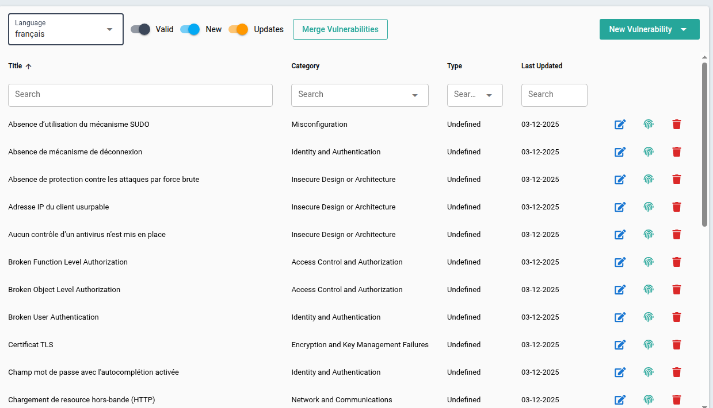

### Fixing the audit (2)

Edit the audit to add a vulnerability, because you juast have found a Cross-Site Scrpting vulnerability in the application you are testing.Click on the green `+` button:

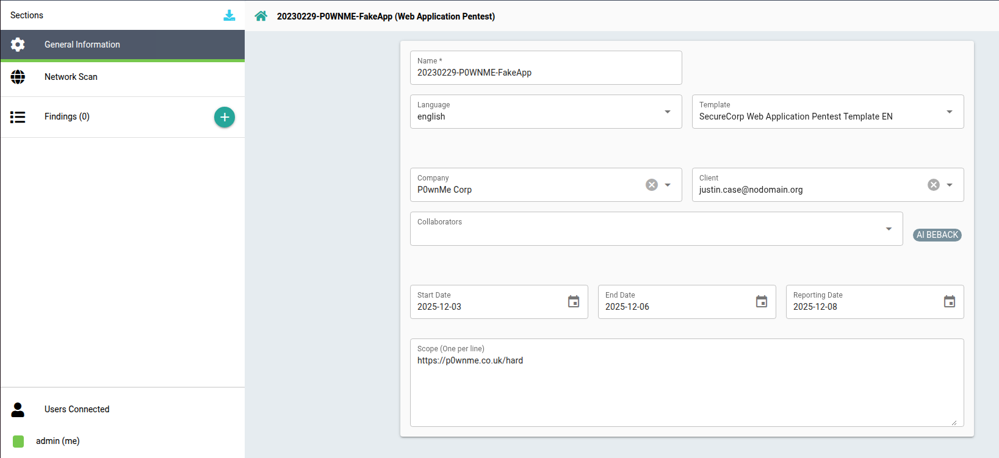

You can see all the vulnerabilities that was imported:

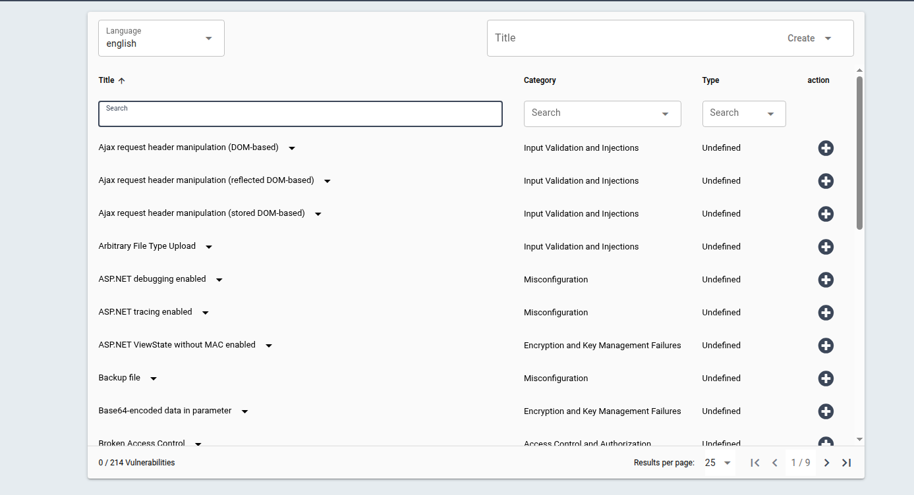

In the search box, type `xss`

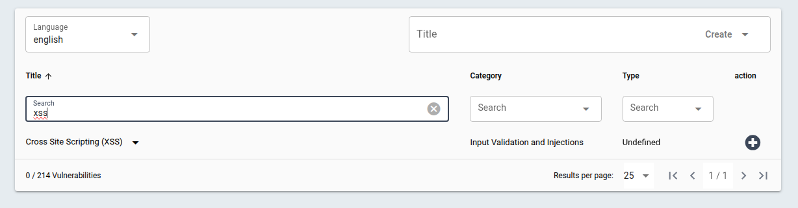

Click on the grey `+`. A vulnerability entry is added in the `Findings` section of the audit.  


Notice that our vulnerability has a blue `N` tag attached to it. It means this vulnerability has no CVSS score by default.

The description field and the references field are the only one filled.


## pwndoc-ng in production

All 3 containers can be run at once using the `docker-compose` file in the root directory.

### SSL Certificates

For production usage make sure to change the certificates in frontend/ssl folder, otherwise anybody and his mother can decrypt or tamper the SSL traffic as the private key used by default is available on github. The public server key file must be named `server.cert`and the server private key file must be named `server.key` because these files names are hardcoded in pwndoc-ng.

By copying these files, you let the NodeJS runtime handle SSL, which may not be the best option, as using a reverse proxy is usually the way to go. In addition, it can be more difficult to  handle the certificates renewal, because updating the certificates seems to require rebuilding the container, leading to a downtime.

Nonetheless, you can use your own certificate by performing the following steps:

TODO

### Custom JWT Secret

You can set the JWT secret in `backend/src/lib/auth.js` (jwtSecret and jwtRefreshSecret in `backend/src/config/config.json`) if you don't want to use random ones.

### Build and run Docker containers

```bash
sudo docker-compose up -d --build
```

### Display backend container logs

```bash
sudo docker-compose logs -f backend
```

### Stop/Start containers

```bash
sudo docker-compose stop
sudo docker-compose start
```

### Remove containers

```bash
sudo docker-compose down
```

### Update

```bash
sudo docker-compose down
sudo git pull
sudo docker-compose up -d --build
```

Application is accessible through <https://localhost:8443> API is accessible through <https://localhost:8443/api>, granted there is a GUI on your local machine.

### Backup

It's possible, even recommended, to regularly backup the mongo-data volume. It contains all the database. Cold backups are preferred as consistency is (almost) guaranteed.

#### Same Server backup (bad idea)

To backup the mongo db database, run

```bash
cd /app/pwndoc-ng
sudo docker-compose stop
sudo docker run --rm -v pwndoc-ng_mongo-data:/_data -v /tmp:/backup busybox tar cvf /backup/pwndoc-db_backup.tar /_data
sudo docker-compose start
```

The command `docker run --rm -v pwndoc-ng_mongo-data:/_data -v /tmp:/backup busybox tar cvf /backup/pwndoc-db_backup.tar /_data` can be broke in the following parts:

- `--rm` : remove the container after it finishes.
- `-v pwndoc-ng_mongo-data:/_data` : mount the MongoDB data volume into the container at `/_data`.
- `-v /tmp:/backup` : mount the host’s `/tmp` directory into the container at `/backup`.
- `busybox` : lightweight Linux image with `tar`.
- `tar cvf /backup/pwndoc-db_backup.tar /_data` : create (c) a verbose (v) archive file (f) named `pwndoc-db_backup.tar` inside `/backup` (host `/tmp`), containing the contents of `/_data`

Please note that the name of the archive could be improved by using the current date to track more precisely what is the date of a backup:

```bash
sudo docker run --rm \
  -v pwndoc-ng_mongo-data:/_data \
  -v /tmp:/backup \
  busybox \
  sh -c "tar cvf /backup/$(date +%Y%m%d-%H%M)_pwndoc-db_backup.tar /_data"
```

#### Database restoration

To restore from a backup, run:

```bash
cd /app/pwndoc-ng
sudo docker-compose stop
sudo docker run --rm -v pwndoc-ng_mongo-data:/_data -v /tmp:/backup busybox tar xvf /backup/pwndoc-db_backup.tar -C /_data
sudo docker-compose start
```

The command `sudo docker run --rm -v pwndoc-ng_mongo-data:/_data -v /tmp:/backup busybox tar xvf /backup/pwndoc-db_backup.tar -C /_data` can be detailed as follow:

- `--rm` : remove the container after it finishes.
- `-v pwndoc-ng_mongo-data:/_data` : mount the MongoDB data volume into the container at /_data.
- `-v /tmp:/backup` : mount the host’s `/tmp` directory into the container at /backup.
- `busybox``` : lightweight Linux image with tar.
- `tar cvf /backup/pwndoc-db_backup.tar /_data` : create (c) a verbose (v) archive file (f) named `pwndoc-db_backup.tar` inside `/backup` (host `/tmp`), containing the contents of `/_data` (MongoDB volume).

Of  course, you have to use the proper name of your backup archive.

TODO : something wrong happened when restoring the data

#### Crontabbing the backup

On a production machine, we planned to backup the data on the first wednesday of each month.

```bash
sudo crontab -e
```

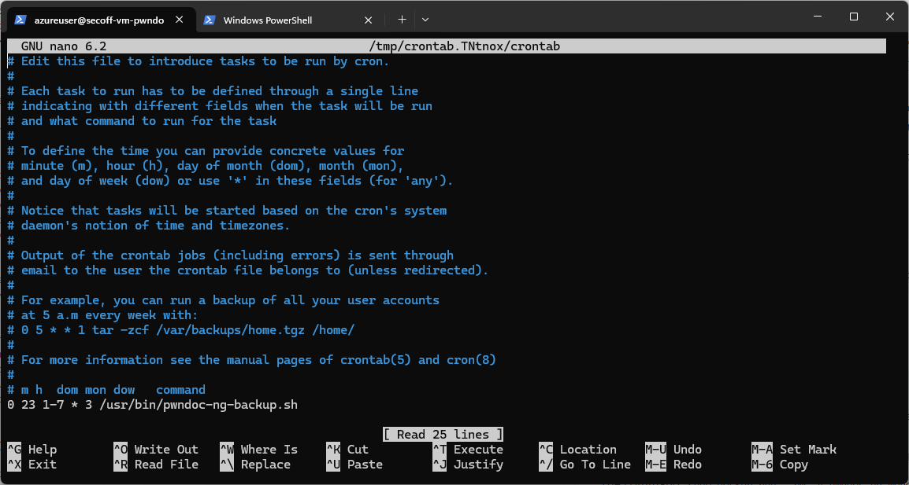

Add the line `0 23 1-7 * 3 /usr/bin/pwndoc-ng-backup.sh`. The script `/usr/bin/pwndoc-ng-backup.sh`
will deal with the backup. You have to create this script and grant it the execute permission.

```bash
# create the folder hierarchy used by the backup process
sudo mkdir -p /backup/pwndoc-ng-data
```

```bash
#! /bin/bash
# perform a backup of the mongo db pwndoc data
# stop the container
sudo docker-compose -f /app/pwndoc-ng/docker-compose.yml stop
# backup the database file and archive it in the /backup/pwndoc-ng-data/ folder
# this way, you have at least a local backup
# DO NOT FORGET TO CREATE THESE FOLDERS !
sudo docker run --rm   -v pwndoc-ng_mongo-data:/_data   -v /backup/pwndoc-ng-data:/backup   busybox   sh -c "tar cvf /backup/$(date +%Y%m%d-%H%M)_pwndoc-db_backup.tar /_data"
# restart the container
sudo docker-compose -f /app/pwndoc-ng/docker-compose.yml start
# synchronize the folder using one drive
# sudo onedrive --synchronize --upload-only
```

```bash
sudo chmod +x /usr/bin/pwndoc-ng-backup.sh
```

If everything is going fine, you will end up with a tar archive :

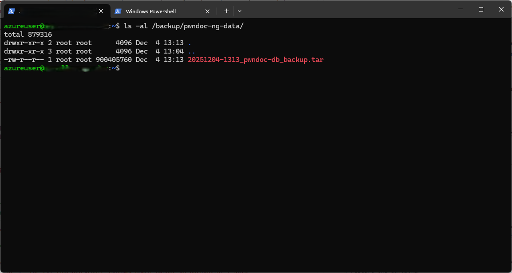

This script is absolutely minimal, and should be improved, by adding logging message and check for errors.

#### OneDrive Backup of pwndoc mongodb data

This section is **very** heavily inspired from <https://first2host.co.uk/blog/onedrive-for-linux-sync-files-to-onedrive/>

It’s recommended to follow a 3-2-1 backup strategy when taking Linux backups of important data. So the idea is that you have three copies of your data. (3) Local Backups on the server. (2) Backups located off the server. (1) Backups located in the cloud. In the case of Linux VPS and Linux Dedicated Servers, you might choose to store backups locally on the server. That’s fine. But if you do decide to do this it’s also important that you store backups somewhere off the server. So you can install OneDrive for Linux to accomplish this and sync/backup Linux to OneDrive or regularly sync files to OneDrive.

##### Install OneDrive Client Ubuntu 22

You can install the OneDrive Linux client on most Linux distributions. For a full list of compatible Operating Systems please see here. We’re installing the OneDrive client on a Ubuntu 22 NVMe VPS Server. You must follow the instructions for your OS. If you are not using Ubuntu see the link above and find your OS. Basic install instructions are located above. Run each command below to install the Ubuntu OneDrive Client on your Linux Server.

```bash
wget -qO - https://download.opensuse.org/repositories/home:/npreining:/debian-ubuntu-onedrive/xUbuntu_22.04/Release.key | gpg --dearmor | sudo tee /usr/share/keyrings/obs-onedrive.gpg > /dev/null

echo "deb [arch=$(dpkg --print-architecture) signed-by=/usr/share/keyrings/obs-onedrive.gpg] https://download.opensuse.org/repositories/home:/npreining:/debian-ubuntu-onedrive/xUbuntu_22.04/ ./" | sudo tee /etc/apt/sources.list.d/onedrive.list
 
sudo apt-get update
sudo apt install --no-install-recommends --no-install-suggests onedrive
```

Now you have the OneDrive client on your server, it’s time to connect it to OneDrive. In the console run the following command and copy + paste the URL in the console to your web browser. Sign in with the OneDrive account you want to link to your Ubuntu 22 server.

```bash
onedrive
```

Once you have logged in to OneDrive you will see a black page. This is normal. Look at the URL and copy the entire URL in the browser address bar to the console.

Back in the SSH console of your Ubuntu 22 server paste the entire URL and press enter. Your Ubuntu server will now be connected to your OneDrive account.

##### Configure Linux Backup Sync to OneDrive

In its default form, the OneDrive client for Linux will sync documents in the ~/OneDrive folder on your server to your OneDrive account. When using the OneDrive client for Linux backups you likely only want a one-way sync. At the moment, if you sync OneDrive with your Linux server all data in your OneDrive account will be downloaded to your server. That’s unnecessary if you simply want to store backups from your Linux server in OneDrive. So next, let’s set up a One-Way sync to OneDrive. Create the below file and copy the defaults for the OneDrive client to the file. You can download our file to your server with the below command or copy and paste the configuration.

```bash
sudo mkdir /etc/onedrive && cd /etc/onedrive && sudo wget https://f2h.ha-cdn.com/Configs/onedrive/config
sudo nano /etc/onedrive/config
```

```text
# Default OneDrive Client Configuration

# Configuration for OneDrive Linux Client
# This file contains the list of supported configuration fields
# with their default values.
# All values need to be enclosed in quotes
# When changing a config option below, remove the '#' from the start of the line
# For explanations of all config options below see docs/USAGE.md or the man page.
#
sync_dir = "/backup/"
# skip_file = "~*|.~*|*.tmp"
# monitor_interval = "300"
# skip_dir = ""
# log_dir = "/var/log/onedrive/"
# drive_id = ""
# upload_only = "false"
# check_nomount = "false"
# check_nosync = "false"
# download_only = "false"
# disable_notifications = "false"
# disable_upload_validation = "false"
# enable_logging = "false"
# force_http_11 = "false"
# local_first = "false"
# no_remote_delete = "false"
# skip_symlinks = "false"
# debug_https = "false"
# skip_dotfiles = "false"
# skip_size = "1000"
# dry_run = "false"
# min_notify_changes = "5"
# monitor_log_frequency = "6"
# monitor_fullscan_frequency = "12"
# sync_root_files = "false"
classify_as_big_delete = "10000"
# user_agent = ""
# remove_source_files = "false"
# skip_dir_strict_match = "false"
# application_id = ""
# resync = "false"
# resync_auth = "false"
# bypass_data_preservation = "false"
# azure_ad_endpoint = ""
# azure_tenant_id = "common"
# sync_business_shared_folders = "false"
# sync_dir_permissions = "700"
# sync_file_permissions = "600"
# rate_limit = "131072"
# webhook_enabled = "false"
# webhook_public_url = ""
# webhook_listening_host = ""
# webhook_listening_port = "8888"
# webhook_expiration_interval = "86400"
# webhook_renewal_interval = "43200"
# space_reservation = "50"
# display_running_config = "false"
# read_only_auth_scope = "false"
# cleanup_local_files = "false"
# operation_timeout = "3600"
# dns_timeout = "60"
# connect_timeout = "10"
# data_timeout = "600"
# ip_protocol_version = "0"
```

Note that there are only two default configuration options we need to change

```text
sync_dir = "/backup/"
classify_as_big_delete = "10000"
```

The `sync_dir` is the directory we are going to sync to OneDrive. Anything inside this folder will be transported to our OneDrive storage. The `classify_as_big_delete` option allows us to delete many files remotely. You may not need this option but you won’t be able to delete a large amount of files out of the `sync_dir` without raising the default limit. Set a sync directory and if needed edit the `classify_as_big_delete` option. Save and close the `/etc/onedrive/config` file.

Once you have set the sync directory, create another folder inside the directory. This will be the folder we sync to OneDrive. Ours is `/backup/pwndoc-ng-data`. Everything in the `/backup/pwndoc-ng-data` folder will be synced.

Of course, you have to create the `/backup/pwndoc-ng-data` folder.

```bash
sudo mkdir /backup/pwndoc-ng-data
```

##### Save Backups To Sync Location

We are using a simple bash script to copy our database files to the sync directory, so there will be a local database backup as well.**This script runs on a cron job at 1 AM each day**.

The script should perform the following:

- stop the containers
- perform a backup of the data and compressing them
- restart the containers

The bash script looks like this. Note there are no errors check.

```bash
# perform a backup of the mongo db pwndoc data
# stop the container
sudo docker-compose -f /app/pwndoc-ng/docker-compose.yml stop
# backup the database file and archive it in the /backup/pwndoc-ng-data/ folder
# this way, you have at least a local backup
sudo docker run --rm   -v pwndoc-ng_mongo-data:/_data   -v /backup/pwndoc-ng-data:/backup   busybox   sh -c "tar cvf /backup/$(date +%Y%m%d-%H%M)_pwndoc-db_backup.tar /_data"
# restart the container
sudo docker-compose -f /app/pwndoc-ng/docker-compose.yml start

```

###### Sync To OneDrive – one_drive_sync.sh

We need to create the folder we created inside the sync directory in OneDrive. It seems that the latest version of the OneDrive client can create folders, but we didn't try. We created the `pwndoc-ng-data` folder in our OneDrive account. To perform the sync we are using a simple bash script with the `–upload-only` flag.

```bash
#!/bin/bash
sudo onedrive --synchronize --upload-only
```

##### Confirm OneDrive For Linux is working

When you run the `onedrive –synchronize –upload-only –dry-run` command this will show you what will happen. No files will be uploaded to OneDrive. Run the command with `–dry-run` first. Don’t forget to place some files inside your sync directory. If all looks good. Run the same command without `–dry-run` to backup your Linux files to OneDrive.

You can then inspect your OneDrive account and confirm the backups were uploaded successfully.


So, we now have our Linux backups uploaded from our Ubuntu 22 server to OneDrive. The entire **`/backup/pwndoc-ng-data/`** folder is being synced to OneDrive. But whilst OneDrive isn’t exactly designed to work with Linux, it is an excellent tool to have to ensure data redundancy in a 3-2-1 backup strategy.

The final script should be

```bash
# perform a backup of the mongo db pwndoc data
# stop the container
sudo docker-compose -f /app/pwndoc-ng/docker-compose.yml stop
# backup the database file and archive it in the /backup/pwndoc-ng-data/ folder
# this way, you have at least a local backup
sudo docker run --rm   -v pwndoc-ng_mongo-data:/_data   -v /backup/pwndoc-ng-data:/backup   busybox   sh -c "tar cvf /backup/$(date +%Y%m%d-%H%M)_pwndoc-db_backup.tar /_data"
# restart the container
sudo docker-compose -f /app/pwndoc-ng/docker-compose.yml start
# synchronize the folder
sudo onedrive --synchronize --upload-only
```

## Development

For development purposes, specific `docker-compose` file can be used in each folder (backend/frontend).

*Source code can be modified live and application will automatically reload on changes.*

### Build and run backend and database containers during development

```bash
sudo docker-compose -f backend/docker-compose.dev.yml up -d --build
```

### Display backend container logs during development

```bash
sudo docker-compose -f backend/docker-compose.dev.yml logs -f pwndoc-ng-backend
```

### Stop/Start containers during development

```bash
sudo docker-compose -f backend/docker-compose.dev.yml stop
sudo docker-compose -f backend/docker-compose.dev.yml start
```

### Remove containers during development

```bash
sudo docker-compose -f backend/docker-compose.dev.yml down
```

Application is accessible through <https://localhost:8081> API is accessible through <https://localhost:8081/api>, granted there is GUI available on your local machine. For the sake of development, we strongly suggest to setup pwndoc-ng on a local development machine using Docker Desktop.

## Tests

For now only backend tests have been written (it's a continuous work in progress)

Test files are located in `backend/tests` using Jest testing framework

Script `run_tests.sh` at the root folder can be used to launch tests :

```bash
Usage:        ./run_tests.sh -q|-f [-h, --help]

Options:
  -h, --help  Display help
  -q          Run quick tests (No build)
  -f          Run full tests (Build with no cache)
```

Don't use it in production as it will delete the production Database !

## Business Objects used by pwndoc-ng

This section is heavily inspired by the corresponding one found in the official pwndoc-ng documentation.

Pwndoc-ng uses different kinds of data to improve and mutualize user experience. This allows to have reusable and customizable information across audits.

### Collaborators

Collaborators are users of the application and can be part of an audit either as the creator or as a collaborative user.

A Collaborator is defined by:

- Username
- Last name
- First name
- Role
- Password

There are 3 different roles:

#### user

- Read/Write on created and collaboration Audits
- Readonly on Vulnerabilities
- Read/Write on Companies and Clients Data

#### report

- Inherit from user role
- +Read/Write on all Audits

#### admin

- Read/Write on everything

### Companies

Companies that order an Audit.

A Company is defined by:

- Name
- Logo

### Clients

Specific clients of companies. Generally the point of contact during a mandate.

A Client is defined by:

- Company
- Last name
- First name
- Email
- Function
- Phone
- Cell

### Templates

Templates are Word documents with special tags that are filled with Audit data when generating the report. See Docx Template section.

A Template is defined by:

- Name
- File

### Custom Data

Custom Data represent a way to fully customize Audits and Vulnerabilities. They are editable and their order can be changed to personalize how they will be displayed for users.

```text
Values must match this regex: /^[\p{Letter}\p{Mark}0-9 \[\]'()_-]+$/iu
```

### Languages

Pwndoc-ng can handle multiple Languages when it comes to Custom Data or Vulnerabilities. It's one of the first things to create before being able to start an Audit.

A language is defined by:

- Language: the displayed name in the application
- Locale: the value used to identify a language in API calls

Example

```text
Language: English   Locale: en
Language: French    Locale: fr
```

### Audit Types

Audit Types represent the nature of an Audit. They can be configured to define default parameters for an Audit.

An Audit Type is defined by:

- Name
- Templates: For each Language a default template can be configured
- Sections: Any Custom Section here will be added when creating an Audit with this Audit Type
- Hidden Sections: Hide built-in sections if not necessary (Network or Findings)

Example

```text
Name: Web Application,
Templates: [English Template, French Template],
Sections: [Executive Summary, Nessus Scan],
Hidden Sections: [Network]
```

### Vulnerability Types

Vulnerability Types represent the nature of a Vulnerability. They are multilingual.

A Vulnerability Type is defined by:

- Name

Example

```text
English
    Name: Wireless,
    Name: Mobile Application
French
    Name: Réseau Sans Fil
    Name: Application Mobile
```

### Vulnerability Categories

Vulnerability Categories are used to categorize a Vulnerability.

A Vulnerability Category is defined by:

- Name

Example

```text
Name: Nessus Scan
```

### Custom Fields

Custom Fields allow to have additional Fields in an Audit or a Vulnerability. They are multilingual.

A Custom Field is defined by:

- View: The page on which Custom Fields will be added
  - Audit General
  - Audit Finding: A Vulnerability Category can be selected. If no Category is selected then every Findings will have Custom Fields
  - Audit Section: A specific Section can be selected. If no Section is selected then every Sections will have Custom Fields
  - Vulnerability: A Vulnerability Category can be selected. If no Category is selected then every Vulnerabilities will have Custom Fields
- Component: The Custom Field type to use
  - Checkbox
  - Date
  - Editor
  - Input
  - Radio
  - Select
  - Select Multiple
  - Space (an empty component used for inserting spaces between other components)
- Label: The displayed value in the GUI and lowercase + strip spaces to use in the docx template
- Description: A hint to be displayed under the component
- Size: The width of the field (1 to 12)
- Offset: The offset from which to start displaying the field (1 to 12)
- Required: The field is required and must not be empty
- Options: Used for multiple selection fields (multiple languages supported)

Each field can have a default value for each existing language.

Example

```text
View: Audit Section
Selected Section: Executive Summary
Component: Editor
Label: Text
Size: 12
Required: True
 
-> This will display an additional HTML editor «Text» field in Executive Summary Sections

View: Vulnerability
Selected Category: None
Component: Input
Label: Id
Size: 2
 
-> This will display an additional input «Id» field in vulnerabilities that will also be displayed in findings
```

### Custom Sections

Custom Sections allow to have additional Sections in an Audit.

A Section is defined by:

- Name
- Field: Used in docx template
- Icon: material, mdi and font awesome are supported

Example

```text
Name: Cleanup
Field: cleanup
Icon: mdi-broom
```

## Roles

Pwndoc-ng can manage different user account roles to access different kind of data with some level of granularity.

There are 2 builtins roles: user and admin. But additional custom roles can easily be added.

### List of permissions

Here is the list of available permissions to access data:

|**Audits**|**Vulnerabilities**|**Data**|**Custom Data**|**Settings**|
|------|----------------|----|-----------|--------|
|audits:create|vulnerabilities:create|users:create|languages:create|settings:read|
|audits:read|vulnerabilities:read|users:read|languages:read|settings:read-public|
|audits:update|vulnerabilities:update|users:update|languages:update|settings:update|
|audits:delete|vulnerabilities:delete|users:delete|languages:delete||
|audits:read-all|vulnerability-updates:create|clients:create|audit-types:create||
|audits:update-all||clients:read|audit-types:read||
|audits:delete-all||clients:update|audit-types:update||
|audits:review||clients:delete|audit-types:delete||
|audits:review-all||companies:create|vulnerability-types:create||
|||companies:read|vulnerability-types:read||
|||companies:update|vulnerability-types:update||
|||companies:delete|vulnerability-types:delete||
|||templates:create|vulnerability-categories:create||
|||templates:read|vulnerability-categories:read||
|||templates:update|vulnerability-categories:update||
|||templates:delete|vulnerability-categories:delete||
|||roles:read|custom-fields:create||
||||custom-fields:read||
||||custom-fields:update||
||||custom-fields:delete||
||||sections:create||
||||sections:read||
||||sections:update||
||||sections:delete||

### Built-In Roles

#### "user" Role

This role has following permissions:

- audits:create, audits:read, audits:update, audits:delete
- vulnerabilities:read, vulnerability-updates:create
- users:read, roles:read
- clients:create, clients:read, clients:update, clients:delete
- companies:create, companies:read, companies:update, companies:delete
- templates:read
- languages:read
- audit-types:read
- vulnerability-types:read
- vulnerability-categories:read
- sections:read
- custom-fields:read
- settings:read-public

#### "admin" Role

This role has full permissions access

### Create additional Roles

Custom roles can be defined in `backend/src/config/roles.json`  The format is:

```json
role_name: {
  allows: [], // Array of allowed permissions to access or use '*' for all (admin)
  inherits: [] // Array of inherited users permissions
}
```

A default custom role is already defined as a `report` role for example:

```json
"report": {
  "inherits": ["user"],
  "allows": [
    "audits:read-all"
  ]
}
```

This role inherits all `user` permissions but since `user` can only access and modify its own Audits, we add the `audits:read-all` permission to report to access all Audits.
To update and delete all Audits additional `audits:update-all` and `audits:delete-all` would be required.

To be able to properly use the review feature of the application, a reviewer role should be added. This reviewer should have the `audits:review` or `audits:review-all` permissions to be able to review reports. A reviewer with only the audits:review permission can only review the reports on which they are assigned. The role could look like the following:

```json
"reviewer": {
  "inherits": ["user"],
  "allows": [
    "audits:review"
  ]
}
```

A reviewer with the `audits:review-all` permission should also have the `audits:read-all` permission to be able to take full advantage of the first one. He could look like the following:

```json
"reviewer": {
  "inherits": ["user"],
  "allows": [
    "audits:review-all",
    "audits:read-all"
  ]
}
```

Keep in mind that these two roles inherit their permissions from the `user` role, which means that they can also create their own audits. A reviewer cannot review an audit for which he is the creator or a collaborator.

## Vulnerabilities

Pwndoc-ng can manage vulnerabilities in order to simplify redaction of an audit. They can be added when editing an Audit as a Finding.
Each vulnerability can have multiple languages.

### Create

When creating a Vulnerability, a Category must be selected (or No Category)

A Vulnerability is defined by:

- Title
- Type
- Language
- Description
- Observation
- CVSS
- Remediation
- Remediation Complexity
- Remediation Priority
- References
- Category
- (Additional fields from Category)

Title must be unique since it's used for another functionality allowing users to request creation/modification of vulnerabilities when redacting an Audit.

There is also the possibility to search Audits containing the Vulnerability in its findings (search by Title) :

[Search in Audits]

### Import/Export

Vulnerabilities can be exported/imported in Data menu.

The export format is yaml.

Example

```text
- cvssv3: 'CVSS:3.1/AV:N/AC:L/PR:N/UI:N/S:U/C:N/I:N/A:N'
  details:
    - references:
        - 'https://cwe.mitre.org/data/definitions/1275.html'
        - >-
          https://owasp.org/www-project-web-security-testing-guide/latest/4-Web_Application_Security_Testing/06-Session_Management_Testing/02-Testing_for_Cookies_Attributes
        - >-
          https://cheatsheetseries.owasp.org/cheatsheets/Cross-Site_Request_Forgery_Prevention_Cheat_Sheet.html#samesite-cookie-attribute
        - >-
          https://cheatsheetseries.owasp.org/cheatsheets/Clickjacking_Defense_Cheat_Sheet.html#defending-with-samesite-cookies
      customFields: []
      locale: EN 
      title: 'Cookie without SameSite attribute [WSTG-SESS-02]'
      description: >-
        The cookie, which is set after the login, has no SameSite-attribute.
      observation: >-
        SameSite is an attribute that can be set in a cookie to instruct the web browser whether that cookie can be sent along with cross-site requests to prevent Cross-Site Request Forgery (CSRF) attacks. The attribute has three possible values:
Strict: The cookie is only sent in a first-party context, preventing cross-site requests from third-party websites to include it.
Lax: The cookie is allowed to be sent in GET cross-site requests initiated by top-level navigation of third-party websites. For example, if you follow a hypertext link from an external website, the request includes the cookie.
None: The cookie is explicitly set to be sent by the browser in any context.
The default behavior of web browsers can differ when handling cookies in a cross-site context, making the final decision to send the cookie in that context unpredictable. The SameSite attribute should be set in every cookie to enforce the expected result from developers.
      remediation: >-
        It is recommended to set the SameSite attribute to 'strict' in the cookie.
  category: Web Application 
  priority: 2
  remediationComplexity: 1
```

For import, the Serpico format is also accepted allowing easier transition or just to have a default set of vulnerabilities.

### Merge

It's possible to merge vulnerabilities for cases where 2 different vulnerabilities exist for 2 different languages. The goal is to avoid duplicates and better multilingual management.

[Merge Vulns]

When both languages have been selected, only Vulnerabilities that don't have the other column language will be displayed.
In this example :

- In the left column only Vulnerabilities having English language AND no French language are displayed
- In the right column only Vulnerabilities having French language AND no English language are displayed

The language details from the Vulnerability of the right column will be moved to the Vulnerability of the left column. So this is CVSS, references, etc of the left column that will be kept.

### Validate

All users can request creation or modifications on a vulnerability when redacting findings in an Audit. Users with admin role can see and validate those modifications in Vulnerabilities menu.

[Validate]

#### New

[New vuln]

Before approving, it's possible to make changes to the Vulnerability including adding Languages.

#### Updates

[Updates vuln]

The left side is the current Vulnerability

The right side has multiple tabs, each representing change requests made by users. There is syntax highlighting to make it easier to spot differences.

The admin user must manually make changes in the left side with what he wants from the right side. When clicking the Update button the left side will be saved and all update requests from the right side will be deleted.

## Audits

Audits represent the core of the application.
To create an Audit, it must have a Language and a Template, so they must be first created in the Custom Data menu.

Audits can be edited by multiple users. Users that opened the Audit are listed at the bottom of the Sections sidebar and you can see the section they are on.
If 2 users are editing the same section, the last one to save will be effective so be careful not to edit the same section at the same time.

[You can safely edit	You are stepping on each other toe]
[Multi-User	Multi-User]

### General Information

This section is about all information relative to the Audit.

[General Information]

It's possible to add Collaborators to an Audit, this will give write access to all Collaborators selected.

### Network Scan

This section allows to import Nmap/Nessus Scans (only port scan).

[Network Scan]

Before importing a scan at least one Audit scope must be defined. Once the scope is created it will appear on Network Scan page. At this point you may follow these steps:

1. Import nmap/nessus scan
2. Select all the hosts associated with the scope
3. Click the + symbol to effectively associate hosts with the scope
4. Save

### Findings

#### Create a finding

Findings can be added either from saved Vulnerablities or by creating a new one. 

[Finding add]

Findings are ordered by Severity and grouped by Category. There are 3 Tabs in a Finding :

##### DEFINITION

General definition of the vulnerability and custom fields of a specific Category if any.

##### PROOFS

Proof of Concept / Exploitation of the vulnerability.

##### DETAILS

Other details like affected assets, CVSS, etc.

#### Actions

Toggle the ```Completed``` checkbox will mark the finding as done.

Finding Completed

The ```Propose Creation / Update in Vulnerability Database``` button will request creation of the finding as a Vulnerability if the Title don't exist or request a modification on the existing Vulnerability (based on the Title). It doesn't directly change the Vulnerability, so feel free to use it. The goal is to make it easier to improve the Vulnerability Database.

Saving can be done with the upper right button or by the most acclaimed feature:  ```Ctrl+S``` or ```⌘+S```

### Custom Sections (bis)

Add any Custom Section previously defined in Custom Data.

[Custom Sections]

### Reviews

To be able to use the review process, the feature must first be activated in the settings. A role with the ```audits:review``` permission should also be added. This new role will be able to review audits and approve them. The roles page gives more details on the permissions of the application. During the whole audit review life cycle, the states, given that the user has enough permissions, can be changed using buttons located on the top left of the audit edit page.

Once this is done, a reviewer can be added to an audit by the creator or a collaborator. This reviewer will then be able to read the content of the audit. The creator and the collaborators can also mark the audit as ready to be reviewed. This action will change the state of the audit from ```EDIT``` to ```REVIEW```.

[Adding a reviewer]

[Marking as ready for review]

When an audit is in the ```REVIEW``` state, a reviewer can give his approval of an audit. The minimal number of approvals before an audit is approved is set in the application's settings page. To know who already approved an audit and how far along it is to be approved, it is possible to hover the mouse over the audit state icon. A tooltip will appear, giving you details on the audit's state.

[Approving an audit]

The tooltip giving information on the audit's current state. Here, two approvals are needed for an audit to be approved. The audit is still in the review phase, even if one person approved it already.

[Information in the tooltip]

Once enough approvals are given for an audit to be approved, the audit passes to the ```APPROVED``` state. In this state, the report is ready to be downloaded and sent to the client.

[Audit is now approved]

The states of the audits can also be seen from the audit list page.

[Audit list page]

The audit edit page, when then review mode is activated, follows the following state machine diagram. Different states show different UI elements. Keep in mind that the Report role here is viewing a report for which he is neither a the creator nor collaborator. Otherwise, on his own reports, his graph would be similar to the Collaborator shown here. Also, the reviewer role, here, has only ```audits:review``` permission, and not ```audits:review-all```.

[Audit edit view state diagram]

## Templating

Pwndoc-ng uses the nodejs library docxtemplater to generate a docx report. Specific documentation can be found on the official site documentation: https://docxtemplater.readthedocs.io/en/v3.1.0/tag_types.html

Check the Default Template for better understanding.

### Different Tags

There can be different tags depending on the value. In the following examples data is the object passed to the docxtemplater engine.

#### Value

```text
data = {key1: value1, key2: value2, key3: value3}
-> {key1} {key2} {key3}
```

#### Array

```text
// Simple Array
data = { array: ['value1', 'value2', 'value3'] }
-> {#array}{.}{/array}

// Array of objects
data = { array: [{name: 'value1'}, {name: 'value2'}, {name: 'value3'}]}
-> {#array}{name}{/array}
```

#### Condition

```text
data = {findings: [{title: 'vuln1', cvss.baseSeverity: 'Critical'}, {title: 'vuln2', cvssSeverity: 'High'}, {title: 'vuln3', cvssSeverity: 'Medium'}]}
-> // List Vulnerabilities with cvssSeverity Critical
{#findings}
{#cvss.baseSeverity == 'Critical'}
{title} : {cvss.baseSeverity}
{/cvss.baseSeverity == 'Critical'}
{/findings}
```

#### HTML values (from text editors)

There is a tag filter convertHTML that convert HTML to open office XML for direct use in the docx template. To handle images, HTML values with images are converted into an array of text and images

```text
// HTML without images (eg: affected scope in finding)
-> {@affected | convertHTML} // this must be the only thing in the paragraph

// HTML with images (eg: poc in a finding)
->
{-w:p poc}{@text | convertHTML}
                                            {-w:p images}{%image}
                                    Image 1 - {caption}{/images}{/poc}
```

### Audit Object

Docxtemplater requires an object containing data that will be used in the template document.

#### name

Name of the audit

Use in template document: ```{name}```

#### auditType

Type of the audit. See Custom Data

Use in template document: ```{auditType}```

#### date

Redacting date

Use in template document: ```{date}```

#### date_start

Start date of the test

Use in template document: ```{date_start}```

#### date_end

End date of the test

Use in template document: ```{date_end}```

#### language

Locale of Audit. Custom Data

Use in template document

```text
// Example with conditional tag
{#language == 'en'}English{/language == 'en'}
```

#### company

Object containing:

- company.name
- company.shortName
- company.logo (max width 400px)
- company.logo_small (height 37px)

Use in template document

```text
{company.name}
// Image tags must be the only thing in the paragraph
{%company.logo} // OK
Image: {%company.logo} // NOT OK
```

#### client

Object containing:

- client.email
- client.firstname
- client.lastname
- client.phone
- client.cell
- client.title

Use in template document

```text
Email: {client.email}
Name: {client.firstname} {client.lastname}
```

#### collaborators

Array of Objects:

- collaborators[i].username
- collaborators[i].firstname
- collaborators[i].lastname
- collaborators[i].email
- collaborators[i].phone
- collaborators[i].role

Use in template document

```text
List of collaborators:
{#collaborators}
Name: {firstname} {lastname}
{/collaborators}
```

#### reviewers

Array of Objects:

- reviewers[i].username
- reviewers[i].firstname
- reviewers[i].lastname
- reviewers[i].email
- reviewers[i].phone
- reviewers[i].role

Use in template document

```text
List of reviewers:
{#reviewers}
Name: {firstname} {lastname}
{/reviewers}
```

#### creator

Object:

- creator.username
- creator.firstname
- creator.lastname
- creator[i].email
- creator[i].phone
- creator.role

Use in template document

```text
Creator: {creator.firstname} {creator.lastname}
```

#### scope

Array of Objects:

- scope[i].name
- scope[i].hosts

Use in template document

Audit Scope:

```text
{-w:p scope}{name}{/scope}

Network Scan: {#scope}{#hosts} {hostname} {ip} {os} : {#services} {port} {protocol} {name} {product} {version} {/services} {/hosts}{/scope}
```

#### findings

List of findings. Array of Objects:

- findings[i].title
- findings[i].vulnType
- findings[i].description (HTML with images)
- findings[i].observation (HTML with images)
- findings[i].remediation (HTML with images)
- findings[i].remediationComplexity (Number 1-3)
- findings[i].priority (Number 1-4)
- findings[i].references (Array of String)
- findings[i].cvss.vectorString
- findings[i].cvss.baseMetricScore
- findings[i].cvss.baseSeverity
- findings[i].cvss.temporalMetricScore
- findings[i].cvss.temporalSeverity
- findings[i].cvss.environmentalMetricScore
- findings[i].cvss.environmentalSeverity
- findings[i].cvssObj (Object of cvss Criteria)
- findings[i].poc (HTML with images)
- findings[i].affected (HTML without images)
- findings[i].status (Number 0:done, 1:redacting)
- findings[i].category
- findings[i].identifier

Identifier consists on a sequential id for the reported vulnerability pre-pended with 'IDX-'. Ex: IDX-001. You can replace the prefix by using the filter ```changeID```

Additional fields will also be added to the findings Array. The key will be lowercase + strip spaces of the label.
Eg. if Custom Field label is ```Aggravating Factors``` it will be added to the array as ```findings[i].aggravatingfactors```.

Use in template document

```text
List of Findings
{#findings}
  {identifier | changeID: 'PROJ1-'}    {title}    {vulnType}
  Severity: {cvss.baseSeverity} 
  Score: {cvss.baseMetricScore} 
  Attack Vector: cvssObj.AV 
  Scope: cvssObj.S Attack 
  Complexity: cvssObj.AC 
  Confidentiality: cvssObj.C 
  Required Privileges: cvssObj.PR 
  Integrity: cvssObj.I 
  User Interaction: 
  cvssObj.UI 
  Availability: cvssObj.A
  Affected Scope {@affected | convertHTML}
  Description {-w:p description}
                {@text | convertHTML} 
                  {-w:p images}{%image} Image 1 - {caption}{/images}
              {/description} 
{/findings}
```

#### Custom Sections (te)

Additional Sections can be added to an Audit. They are accessible in the docx template with the specific Field defined in Custom Sections

Use in template document

```text
// Example with a Cleanup Section: {name: 'Cleanup', field: 'cleanup', text: 'Default text for Cleanup Section'}
CLEANUP SECTION (or use {cleanup.name} as title)
{-w:p cleanup.text}{@text | convertHTML}
                                            {-w:p images}{%image}
                                    Image 1 - {caption}{/images}{/cleanup.text}
```

### Styles

Styles for simple text can be defined and applied directly in the Docx Template.

But in order to apply styles to the data from HTML editors, they must be defined in the Docx Template according to this :

|**HTML Style**|**Docx Style**|
|--------------|--------------|
|paragraph|HTMLTextStyle|
|H1|Heading1|
|H2|Heading2|
|H3|Heading3|
|H4|Heading4|
|H5|Heading5|
|H6|Heading6|
|code (<>)|CodeChar|
|code block|Code|
|Hyperlink|PwndocLink|

For ```bullet list``` and ```ordered list``` they must be correctly set in the numbering.xml file of the Docx Template.

Open the file with an archive manager

[Docx Archive]

The numbering.xml file contains definitions of numbering lists. ```<w:abstractNum w:abstractNumId=0>...</w:abstractNum>``` tags represent the definition of a numbering with its different levels. ```<w:num w:numId="1"><w:abstractNumId w:val="0" /></w:num>``` tags associate the effective Id used in the document with the abstract Id of the definition.

Pwndoc-ng uses ```numId="1"``` for bullet list and ```numId="2"``` for ordered list. So the only thing to change in the file is the value of the abstractNumId associated with those numId.

If there is no abstractNum definitions, this means that no numbering has been used in the document: open the document with Word, add bullet and ordered list, save, delete bullet and ordered list, save. There should now be abstractNum definition for each one.

### Filters

Filters allow to apply functions on Audit data values.

#### Charts

Creates a chart (pie chart or bar chart) linked to findings.

For the moment, the pie chart can only be used with severity. The bar chart can be used with any finding field.

- Colors are in hex format without the "#" (FF5522)
- Label size are in word's format (15pt = 1500)

Use in template document

```text
// Examples of simple pie chart:
{@findings | barChart:'field':'title':'barColor':'labelColor':'labelSize'}
{@findings | pieChart:'My bar chart':'000000':'FF0000':'FFA500':'FFFF00'}

// Examples of bar chart:
{@findings | barChart:'field':'title':'barColor':'labelColor':'labelSize'}
{@findings | barChart:'vulnType':'My bar chart'}
{@findings | barChart:'cvss.baseSeverity':'My chart':'FF0000':'AABB00':'1500'}
```

##### Custom Charts

Before using pwndoc-ng, we used other mean to craft our pentest reports, and we used two charts we deemed valuable.

Theses charts was generated using VBA Macro. To not face issue with these macro, we simply decided to get rid of them, and put our hand dirty by taking a look a the pwndoc-ng source code as well as in the XML of our old reports (not containg clients data of course. Remember to delete your old reports ^^ ). The VBA macro we used won't work outside a Windows machine because they use COM object.

So we are proud to share with you two custom filters building these charts:

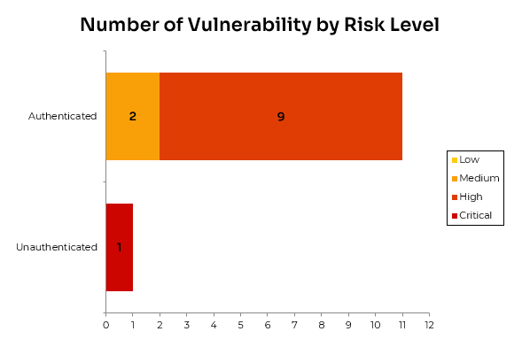

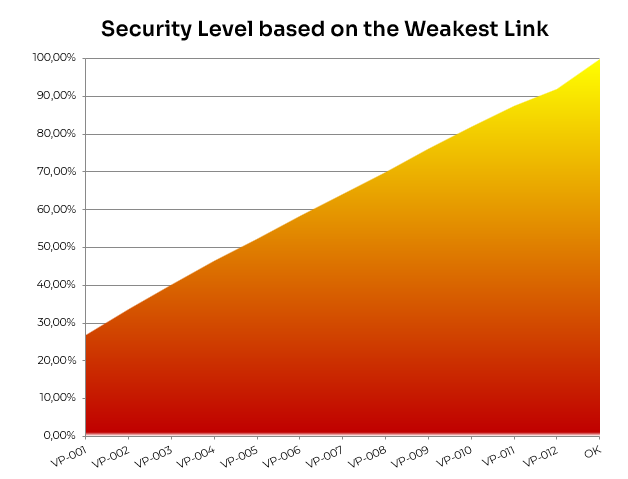

Remember you have to patch the `pwndoc-ng/backend/src/lib/report-generator.js` with the pact mentionned somewhere in this document

Use in template

```text
// stacked bar chart
{@findings | stackedBarChart:'Number of Vulnerability by Risk Level':'cc0500':'df3d03':'f9a009':'ffcb0d'}

// security based on the weakest link chart
{@findings | weakestLinkChart:'Security Level based on the Weakest Link':'cc0500':'df3d03':'f9a009':'ffcb0d'}
```

Note that using these filter without patching the source code raises an error.

For now, the patch does not take vulnerability prefix into account. The screenshots you see above is the result of an hand-made update of the data.

#### bookmarkCreate

Creates a text block or a location bookmark:

- Text block bookmarks contain some text which can then be referenced in a clickable reference field using the ```bookmarkRef``` filter. These bookmarks can also be used as a hyperlink target using the ```bookmarkLink``` filter.
- Location bookmark simply allow to point to a location within the document which cas be used as a hyperlink target using the ```bookmarkLink``` filter.

Bookmark identifiers need to begin with a letter and contain only letters, numbers, and underscore characters: non-conforming characters are automatically replaced by underscores. Moreover, due to a limitation in MS-Word, identifiers longer than 40 characters are truncated.

Use in template document

```text
// Example of text block bookmark, the bookmark identifier contains the name value:
{@name | bookmarkCreate: identifier | p}
// Example adding some other text in the same paragraph and using a custom paragraph style:
{@'Some text: ' + (name | bookmarkCreate: identifier) | p: 'Heading 1'}
// Example of location bookmark:
{@identifier | bookmarkCreate | p}
```

#### bookmarkLink

Creates a hyperlink to a text block or location bookmark usually created using the ```bookmarkCreate``` filter.

Bookmark identifiers need to begin with a letter and contain only letters, numbers, and underscore characters: non-conforming characters are automatically replaced by underscores. Moreover, due to a limitation in MS-Word, identifiers longer than 40 characters are truncated.

Use in template document

```text
{@input | bookmarkLink: identifier | p}
// Example adding some other text in the same paragraph:
{@'Some text: ' + (input | bookmarkLink: identifier) | p}
```

#### bookmarkRef

Creates a clickable reference to a text block bookmark usually created using the ```bookmarkCreate``` filter.

Bookmark identifiers need to begin with a letter and contain only letters, numbers, and underscore characters: non-conforming characters are automatically replaced by underscores. Moreover, due to a limitation in MS-Word, identifiers longer than 40 characters are truncated.

Use in template document

```text
{@identifier | bookmarkRef | p}
// Example adding some other text in the same paragraph:
{@'Some text: ' + (identifier | bookmarkRef) | p}
```

#### capfirst

Capitalizes input first letter.

Use in template document

```text
// Example with "hello world"
{input | capfirst} -> "Hello world"
```

#### changeID

Replaces the default identifier prefix (IDX-) by the supplied prefix

Use in template document

```text
{identifier | changeID: 'PROJ1-'}

#### convertDate

Convert Date to proper format. Must be used on values with date format.

Use in template document

```text
// Example with {date_start: '2020-10-29'}
{date_start | convertDate: 'short'} -> 10/29/2020
{date_start | convertDate: 'full'} -> Thursday, October 29, 2020
```

#### convertDateLocale

Convert Date to proper format using locale. Must be used on values with date format.

Use in template document

```text
// Example with {date_start: '2020-10-29'}
{date_start | convertDateLocale: 'de-DE':'short'} -> 29.10.2020
{date_start | convertDateLocale: 'fr':'full'} -> Jeudi 29 Octobre 2020
```

#### convertHTML

Convert HTML values to OOXML format. See HTML values for usage.

Use in template document

```text
{@value | convertHTML}
```

#### count

Count the number of vulnerabilities by CVSS severity.

Use in template document

```text
// Example counting 'Critical' vulnerabilities
{findings | count: 'Critical'}
```

#### d

Default value: returns input if it is truthy, otherwise its parameter.

Use in template document

```text
// This generates a comma-separated list of affected systems, falling-back on the whole audit scope if left empty.
{affected | lines | d: (scope | select: 'name') | join: ', '}
```

#### fromTo

Display "From ... to ..." dates nicely, removing redundant information when the start and end dates occur during the same month or year.

The resulting text can be typically used in a table summarizing the audit, audit perimeters or audits campaign properties, or inside a text paragraph such as a management summary.

To internationalize or customize the resulting string, associate the desired output to the strings ```"from {0} to {1}"``` and ```"on {0}"``` in your Pwndoc translate file. Date formating relies on the locale name provided as second parameter.

Use in template document

```text
{date_start | fromTo: date_end:'en-UK' | capfirst}
// Output varies automatically depending on the start and end dates:
// - Same day        -> On 28/11/2022
// - Same month      -> From 28 to 30/11/2022
// - Same year       -> From 28/11 to 02/12/2022
// - Different years -> From 28/11/2022 to 06/01/2023
```

#### groupBy

Group input elements by an attribute.

The elements are returned as an objects set where:

The 'key' property is the common attribute value,
The 'value' property is the set of items from the input structure sharing this same value for this attribute.

Use in template document

```text
{#findings | groupBy: 'severity'}
Severity: {key}
{#value}
Title: {title}
{/value}
{/findings | groupBy: 'severity'}
```

#### initials

Returns the initials from an input string (typically a firstname).

Use in template document

```text
// Example with "Foo-Bar"
{creator.firstname | initials} -> "F.-B."
```

#### join

Returns a string which is a concatenation of input elements using an optional separator string.

Can also be used to build raw OOXML strings.

Use in template document

```text
{references | join: ', '}
```

#### length

Returns the length (ie. number of items for an array) of input.

Can also be used as a conditional to check the emptiness of a list.

Use in template document

```text
// Display the number of elements:
{findings | length}
// Continue only if non-empty:
{#input | length}Not empty{/input | length}
```

#### lines

Takes a multilines input strings (either raw or simple HTML paragraphs) and returns each line as an ordered list.

Use in template document

```text
{input | lines}
```

#### linkTo

Takes a text to display and a URL to generate a hyperlink. To apply a custom style to hyperlinks, add a style named "PwndocLink" in word templates.

Use in template document

```text
{@cvss.vectorString | linkTo: 'https://www.first.org/cvss/calculator/3.1#' + cvss.vectorString}
```

#### loopObject

Loop over the input object, providing access to its keys and values.

Use in template document

```text
{#findings | loopObject}
{key}: {value.title}
{/findings | loopObject}
```

### lower

Lowercases input.

Use in template document

```text
// Example with "Hello WORLD"
{input | lower} -> "hello world"
```

#### mailto

Creates a clickable "mailto:" link, assumes that input is an email address if no other address has been provided as parameter.

The character style "PwndocLink" is applied to the generated hyperlink.

Use in template document

```text
{@lastname | mailto: email | p}
// Example adding some other text in the same paragraph and displaying the email address instead of the last name:
{@'Some text: ' + (email | mailto) | p}
```

#### map

Applies a filter on a sequence of objects.

Use in template document

```text
{scope | select: 'name' | map: lower | join: ', '}
```

#### p

Embeds input within OOXML paragraph tags, applying an optional style name to it.

Use in template document

```text
{@input | p: 'Some style'}
```

#### reverse

Reverses the input array order.

Use in template document

```text
{input | reverse}
```

#### s

Add proper XML tags to embed raw string inside a docxtemplater raw expression.

Use in template document

```text
// Example creating a text block bookmark containing the vulnerability title prefixed by the static string "Vulnerability: ":
{@('Vulnerability: ' | s) + title | bookmarkCreate: identifier | p}
```

#### select

Looks up an attribute from a sequence of objects, doted notation is supported.

Use in template document

```text
{findings | select: 'cvss.environmentalSeverity'}
```

#### sort

Sorts the input array according an optional given attribute, dotted notation is supported.

Use in template document

```text
{#findings | sort 'cvss.environmentalSeverity'}{name}{/findings | sort 'cvss.environmentalSeverity'}
```

#### sortArrayByField

Sort array by supplied field. S Order can be 1 for ascending, or -1 for descending

Use in template document

```text
{#findings | sortArrayByField: 'identifier':1}
{identifier}
{/}
```

#### split

Takes a string as input and split it into an ordered list using a separator.

Use in template document

```text
{input | split: ', '}
```

#### title

Capitalizes input first letter of each word, can be associated to 'lower' to normalize case.

Use in template document

```text
// Example with "john DOE"
{creator.lastname | lower | title} -> "John Doe"
```

#### toJSON

Returns the JSON representation of the input value, useful to dump variables content while debugging a template.

Use in template document

```text
{input | toJSON}
```

#### upper

Upercases input.

Use in template document

```text
// Example with "Hello World"
{input | upper} -> "HELLO WORLD"
```

#### where

Filters input elements using a free-form Angular statement.

Use in template document

```text
{#findings | where: 'cvss.severity == "Critical"'}{title}{/findings | where: 'cvss.severity == "Critical"'}

Custom filters can also be created in ```backend/src/lib/custom-generator.js```. As an example there are 2 filters defined for french reports.
```

#### convertDateFR (custom)

Convert Date to proper format in French. Must be used on values with date format.

Use in template document

```text
// Example with {date_start: '2020-10-29'}
{date_start | convertDateFR: 'short'} -> 29/10/2020
{date_start | convertDateFR: 'full'} -> Jeudi 29 Octobre 2020
```

#### criteriaFR (custom)

Convert cvss Criteria to French.

Use in template document

```text
// Example with cvssObj.AV === 'Network'
{cvssObj.AV | criteriaFR} -> Réseau
```

#### $pageBreakExceptLast

Creates Page Break

Use in template document

```text
{@$pageBreakExceptLast}
```

### F.A.Q.

- I'd like to make a condition on existing vulnerability severity.

You can use the following:

Use in template document

```text
{#findings | count: 'High'}
There is at least one High vulnerability
{/}
```

See #81.

- I'd like to parse a specific part of a complex text field.

You can develop your own custom filter (see ```custom-generator.js``` and ```report-generator.js```) OR use custom fields instead.

- I want my text to render with a defined style.

You can use the ```p``` filter which render an input with a given style:

Use in template document

```text
{@input | p: 'Some style'}
```

Note: spaces and specials chars may be removed from your style name. You can verify the different styles using the following trick:

1. Rename template ```.docx``` to ```.zip```.
2. Extract archive
3. Open ```word/styles.xml```
4. Inspect the different styles names (```styleId``` fields).

- I want to get the index of an element in a loop

Pwndoc-NG use a custom angular parser which provide syntaxes such as <$index>.

Use in template document

```text
{#names}
{#$index == 0}First item !{/}
{names[$index]}
{ages[$index]}
{/names}
```

- I want to parse a simple list

Simple list are less documented than dict. Therefore you may struggle with parsing simple list. You may have the following solutions:

1. use the ```{.}``` syntax which refer to the current element in a loop;
2. use the ```| loopObject``` filter which transform a list into a dict;
3. use the ```$index``` variable and refer the element as ```list[$index]```.

Use in template document

```text
{#references}
{.}
{/}
{#references | loopObject}
{@value | linkTo: value | p}
{/}
```

- List and numbered list are buggy.

List and numbered list formatting are based on the XML contained in the Docx template.

You'll have to adapt this XML. TODO

## Debug

No application runs without encountering bug. This section depicts some issues we mostly encountered during our pwndoc-ng usage.

### Docx Template

You may encounter several issues regarding the templates.

#### Server-Side Issues

When the template is buggy, for example when a Docx Templater tag is not properly closed, the application complains, but the error message is not particularly meaningful.

TODO

#### Local Issues

Sometimes, the report could be properly generated by the application back-end, but when you open it using Word, you encounter a cryptic message:


Time to learn french, I guess.

The issue occurs because the Open Office XML is not properly built. An old bug in the `linkTo` filter causes the XML tag for a link not to be non-compliant. Lastly, we encounter the Bug when using custom filters building charts, because theses filters use the CVSS object to build its data. If the CVSS objet was null, for example when no CVSS score is created for a vulnearbility, the XML for the chart is not compliant, makin Word complaining.

Inrestingly, LibreOffice Writer is more tolerant and happily opens the file. You can then try to spot where the problem occur.

As a general rule, it's a good idea to open your generated document using differents Open XML client to asset the rendering of your document.

#### The Version Custom Property

We added a custom Property in the Docx template called "vserion" to track the version of the report. For unknown reason, the property is not properly rendered, and you can see an ugly message such as ""

### NoSQL Database

Attach a shell to the running mongoDB container:

```sh
docker exec -it mongo-pwndoc-ng /bin/sh
```

Then connect to the database:

```sh
mongo mongodb://127.0.0.1/pwndoc
```

To list collections as described in Data you can use one of the following commands from the DB shell:

- ```show collections```
- ```db.getCollectionNames()```
- ```show tables```

For example:

```sh
> show collections
audits
audittypes
clients
companies
customfields
customsections
images
languages
templates
users
vulnerabilities
vulnerabilitycategories
vulnerabilitytypes
```

Then you can inspect the entries of each collection:

```sh
> db.<collection>.find()
```

Example for users:

```sh
> db.users.find()
{ "_id" : ObjectId("REDACTED"), "role" : "admin", "username" : "demo", "password" : "REDACTED", "firstname" : "demo", "lastname" : "demo", "createdAt" : ISODate("2020-08-21T15:45:18.999Z"), "updatedAt" : ISODate("2020-09-21T14:45:18.999Z"), "__v" : 0 }
...
```

You can access a specific entry using an array index, eg for a specific audit:

```sh
> db.audits.find()[1]
```

Of course you can continue to nest attributes/nodes, eg:

```sh
> db.audits.find()[1].findings[0].references[0]
```

Then you can use db.collection.find shell method to query specific objects:

```sh
> db.users.find( { username: "demo" } )
```

It is possible to filter the output:

```sh
> db.users.find( { role: "admin" }, {_id: 1} )
```

For example to get a synthetic view of custom fields:

```sh
> db.customfields.find( {}, {_id: 0, updatedAt: 0, size: 0, position: 0, createdAt: 0, __v: 0, offset: 0})
> db.customfields.find( {}, {label: 1, fieldType: 1, description: 1, display: 1, displaySub: 1, required: 1, _id: 0})
{ "displaySub" : "", "required" : true, "description" : "", "fieldType" : "input", "label" : "VulnID", "display" : "vulnerability" }
{ "displaySub" : "Orga", "required" : true, "description" : "", "fieldType" : "input", "label" : "RefID", "display" : "vulnerability" }
```
